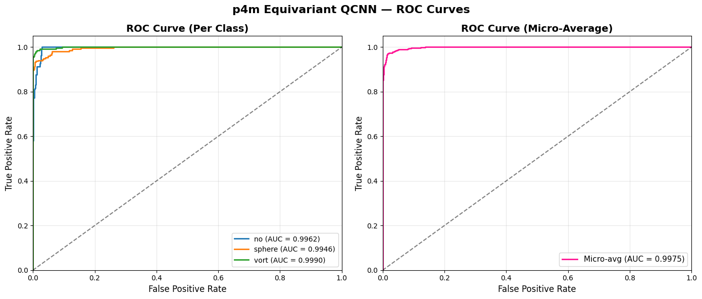
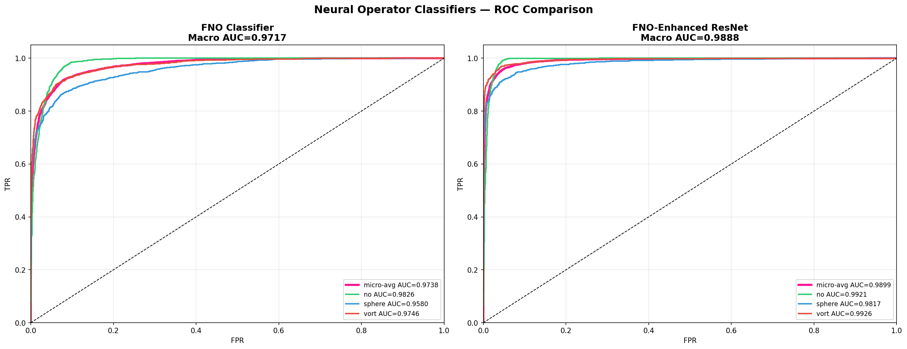

# GSoC 2026 - ML4SCI DeepLense: Evaluation Tests

**Applicant:** Sushmanth Reddy

This repository contains my solutions for the [Google Summer of Code 2026](https://summerofcode.withgoogle.com/) evaluation tests for the **ML4SCI DeepLense** project. All tasks address challenges in strong gravitational lensing using deep learning, from multi-class classification to super-resolution and generative modeling.

**Projects of Interest (in order of preference):**
1. [Quantum Machine Learning for Strong Lensing](https://ml4sci.org/gsoc/2026/proposal_DEEPLENSE5.html)
2. [Neural Operators for Learning Lensing Maps](https://ml4sci.org/gsoc/2026/proposal_DEEPLENSE5.html)
3. [Image Super-Resolution for Strong Lensing](https://ml4sci.org/gsoc/2026/proposal_DEEPLENSE5.html)
4. [Physics-Guided Machine Learning for Strong Lensing](https://ml4sci.org/gsoc/2026/proposal_DEEPLENSE5.html)
5. [Gravitational Lens Finding](https://ml4sci.org/gsoc/2026/proposal_DEEPLENSE5.html)
6. [Diffusion Models for Strong Lensing](https://ml4sci.org/gsoc/2026/proposal_DEEPLENSE5.html)

---

## Results Summary

| Test | Task | Architecture | Key Metric | Score |
|------|------|-------------|------------|-------|
| **Common Test I** | Multi-Class Classification | ESCNN + ResNet-18 | ROC-AUC | **0.9882** |
| **Specific Test II** | Lens Finding | ESCNN + ResNet-18 | ROC-AUC | **0.9867** |
| **Specific Test III** | Quantum ML | E2-CNN + p4m Equivariant QCNN | ROC-AUC | **0.9966** |
| **Specific Test IV** | Neural Operators | U-Shaped FNO Classifier | ROC-AUC | **0.9977** |
| **Specific Test V** | Physics-Guided ML | E2-Equivariant PINN (3-stream) | ROC-AUC | **0.9629** |
| **Specific Test VI.A** | Super-Resolution (Simulated) | EDSR + LIIF | PSNR / SSIM | **41.79 dB / 0.9766** |
| **Specific Test VI.B** | Super-Resolution (Real) | EDSR-EQ + LIIF-EQ | PSNR / SSIM | **34.81 dB / 0.8281** |
| **Specific Test VIII** | Diffusion Models | DDPM + UNet | FID | **3.80** |

---

## Repository Structure

```
Task/
├── README.md                                        # This file
├── common_task/                                     # Common Test I: Multi-Class Classification
│   ├── gsoc_common_task.ipynb                       #   ESCNN canonicalization + ResNet-18
│   ├── README.md
│   └── checkpoints/
├── Specific_Test_II_Lens_Finding/                   # Specific Test V: Lens Finding
│   ├── notebooks/gsoc_specific_test_2_lens.ipynb    #   Binary classification on real survey data
│   └── README.md
├── Specific_Test_III_Quantum_ML/                    # Specific Test III: Quantum ML
│   ├── torchquantum_v10.ipynb                       #   ResNet-18 + variational QC
│   ├── hybrid_ecnn_qnn_torchquantum.ipynb           #   E2-CNN + variational QC
│   ├── equiv_qnn.ipynb                              #   E2-CNN + p4m Equivariant QCNN (best)
│   └── README.md
├── Specific_Test_IV_Neural_Operators/               # Specific Test IV: Neural Operators
│   ├── neural_operator_classifier.ipynb             #   FNO + FNO-Enhanced ResNet classifiers
│   ├── u-shaped-fno_enhanced_resnet.ipynb           #   U-Shaped FNO-Enhanced ResNet (hybrid)
│   ├── u-shaped_fno_classifier.ipynb                #   U-Shaped FNO Classifier (best, ROC-AUC 0.9977)
│   ├── README.md
│   └── checkpoints/
├── Specific_Test_IV_Diffusion_Models/               # Specific Test VIII: Diffusion Models
│   ├── image_resolution.ipynb                       #   DDPM for lensing image generation
│   ├── README.md
│   └── results/
├── Specific_Test_V_Physics_Guided_ML/               # Specific Test VII: Physics-Guided ML
│   ├── notebooks/pinn.ipynb                         #   E2-equivariant PINN with SIS lens model
│   └── README.md
└── Specific_Test_VI_Image_Super_Resolution/         # Specific Test VI: Super-Resolution
    ├── task_a/LIIF_Lensing_Training_2.ipynb         #   EDSR + LIIF (simulated data)
    ├── task_b/LIIF_EQ_Lensing_TaskB_v4.ipynb        #   EDSR-EQ + LIIF-EQ (real HSC/HST)
    └── README.md
```

---

## Task Details

### Common Test I: Multi-Class Classification

Classify gravitational lensing images into 3 classes (no substructure / spherical / vortex) using the [DeepLense dataset](https://drive.google.com/file/d/1QUVUpknFKMKLKvzWz-BWBOnL1Mf8b5tv/view) (150x150 grayscale, 30K training images).

**Approach:** E(2)-equivariant canonicalization network (ESCNN with C8 symmetry) normalizes image orientation before a pretrained ResNet-18 backbone classifies the canonicalized images. This encodes the rotational symmetry of gravitational lensing directly into the architecture.

| Metric | Score |
|--------|-------|
| ROC-AUC (macro) | **0.9882** |
| Accuracy | 93.71% |


[Full details →](common_task/README.md)

---

### Specific Test II: Lens Finding & Data Pipelines

Binary classification of real observational data -- lensed vs non-lensed galaxies (3-channel, 64x64). Highly imbalanced dataset.

**Approach:** ESCNN canonicalization + ResNet-18 with class-weighted loss to handle imbalance.

| Metric | Score |
|--------|-------|
| ROC-AUC | **0.9867** |
| Accuracy | 92.96% |


[Full details →](Specific_Test_II_Lens_Finding/README.md)

---

### Specific Test III: Quantum ML

Hybrid quantum-classical classification using parameterized quantum circuits for the 3-class lensing task.

**Approach:** Three hybrid models explored. The best model pairs an E2-equivariant CNN backbone with a p4m equivariant QCNN that preserves symmetry at both the classical and quantum levels. The equivariant QCNN uses only 33 trainable quantum parameters yet outperforms the 144-parameter variational circuit because every parameter respects the problem's symmetry.

| Model | ROC-AUC | Accuracy |
|-------|---------|----------|
| ResNet-18 + Quantum Circuit | 0.9837 | 92.40% |
| E2-CNN + Quantum Circuit | 0.9812 | 94.93% |
| E2-CNN + p4m Equivariant QCNN | **0.9966** | **96.93%** |



[Full details →](Specific_Test_III_Quantum_ML/README.md)

---

### Specific Test IV: Neural Operators

Classification using spectral convolution architectures that operate in function space via FFT. Four models are compared -- from pure spectral classifiers to hybrid CNN+spectral designs -- with the U-shaped FNO classifier achieving the best results.

**Approach:** Progressive exploration of spectral convolution for lensing classification: (1) FNO classifier, (2) FNO-Enhanced ResNet hybrid, (3) U-shaped FNO-enhanced ResNet combining spectral convolution with U-Net-style encoder-decoder branches, and (4) pure U-shaped FNO classifier with multi-scale local + global frequency processing.

| Model | ROC-AUC | Accuracy |
|-------|---------|----------|
| FNO Classifier | 0.9717 | 88.31% |
| FNO-Enhanced ResNet | 0.9888 | 93.54% |
| U-Shaped FNO-Enhanced ResNet | 0.9942 | 96.44% |
| U-Shaped FNO Classifier | **0.9977** | **98.31%** |

The U-Shaped FNO Classifier **significantly surpasses the Common Test I baseline** (0.9977 vs 0.9882).



[Full details →](Specific_Test_IV_Neural_Operators/README.md)

---

### Specific Test V (VII): Physics-Guided ML

Physics-Informed Neural Network (PINN) that embeds the gravitational lensing equation (SIS model) directly into the forward pass.

**Approach:** 3-stream E2-equivariant architecture with (1) Einstein radius predictor, (2) SIS physics module computing convergence/shear/magnification maps, and (3) source reconstruction via ray-tracing. Cross-attention fusion combines all streams.

| Metric | Score |
|--------|-------|
| ROC-AUC (macro) | **0.9629** |
| Accuracy | 92.01% |


[Full details →](Specific_Test_V_Physics_Guided_ML/README.md)

---

### Specific Test VI: Image Super-Resolution

Arbitrary-scale super-resolution for strong lensing images using implicit neural representations.

**Approach:** EDSR encoder + LIIF (Local Implicit Image Function) decoder for continuous-scale upsampling. Task VI.B uses E2-equivariant variants (EDSR-EQ + LIIF-EQ) fine-tuned on real HSC/HST telescope pairs.

| Task | PSNR | SSIM | MSE |
|------|------|------|-----|
| VI.A (Simulated) | **41.79 dB** | **0.9766** | 0.000068 |
| VI.B (Real HSC/HST) | **34.81 dB** | **0.8281** | 0.000494 |


[Full details →](Specific_Test_VI_Image_Super_Resolution/README.md)

---

### Specific Test VIII: Diffusion Models

Generative modeling of strong gravitational lensing images using Denoising Diffusion Probabilistic Models (DDPM).

**Approach:** DDPM with UNet backbone using predict-x0 parameterization. Generates realistic lensing images from noise.

| Metric | Score |
|--------|-------|
| FID | **3.80** |


[Full details →](Specific_Test_IV_Diffusion_Models/README.md)

---

## Common Themes Across Solutions

Several design principles are shared across the solutions:

1. **Rotation Equivariance:** Gravitational lensing is rotationally symmetric. ESCNN-based E(2)-equivariant networks are used in Common Test I, Test II, Test III, Test V, and Test VI.B to encode this symmetry.

2. **Spectral Domain Processing:** Neural operators (Test IV) and diffusion models (Test VIII) leverage Fourier-domain operations for global feature extraction, complementing spatial CNNs.

3. **Physics-Informed Design:** The PINN (Test V) embeds the SIS lens equation directly into the network. The equivariant canonicalization (Common Test I) encodes known geometric symmetries. Neural operators (Test IV) are motivated by the PDE nature of lensing.

4. **Pretrained Backbones:** Where applicable, ImageNet-pretrained ResNet-18 backbones provide strong initialization, with task-specific heads and augmentations.

---


## References

1. Weiler, M. & Cesa, G. "General E(2)-Equivariant Steerable CNNs." NeurIPS 2019.
2. Li, Z. et al. "Fourier Neural Operator for Parametric Partial Differential Equations." ICLR 2021.
3. Guibas, J. et al. "Adaptive Fourier Neural Operators: Efficient Token Mixers for Transformers." ICLR 2022.
4. Ho, J. et al. "Denoising Diffusion Probabilistic Models." NeurIPS 2020.
5. Chen, Y. et al. "Learning Continuous Image Representation with Local Implicit Image Function." CVPR 2021.
6. [ML4SCI DeepLense Project](https://github.com/ML4SCI/DeepLense)

---

## Author

**Susmanth Reddy**
GSoC 2026 Applicant -- ML4SCI DeepLense
