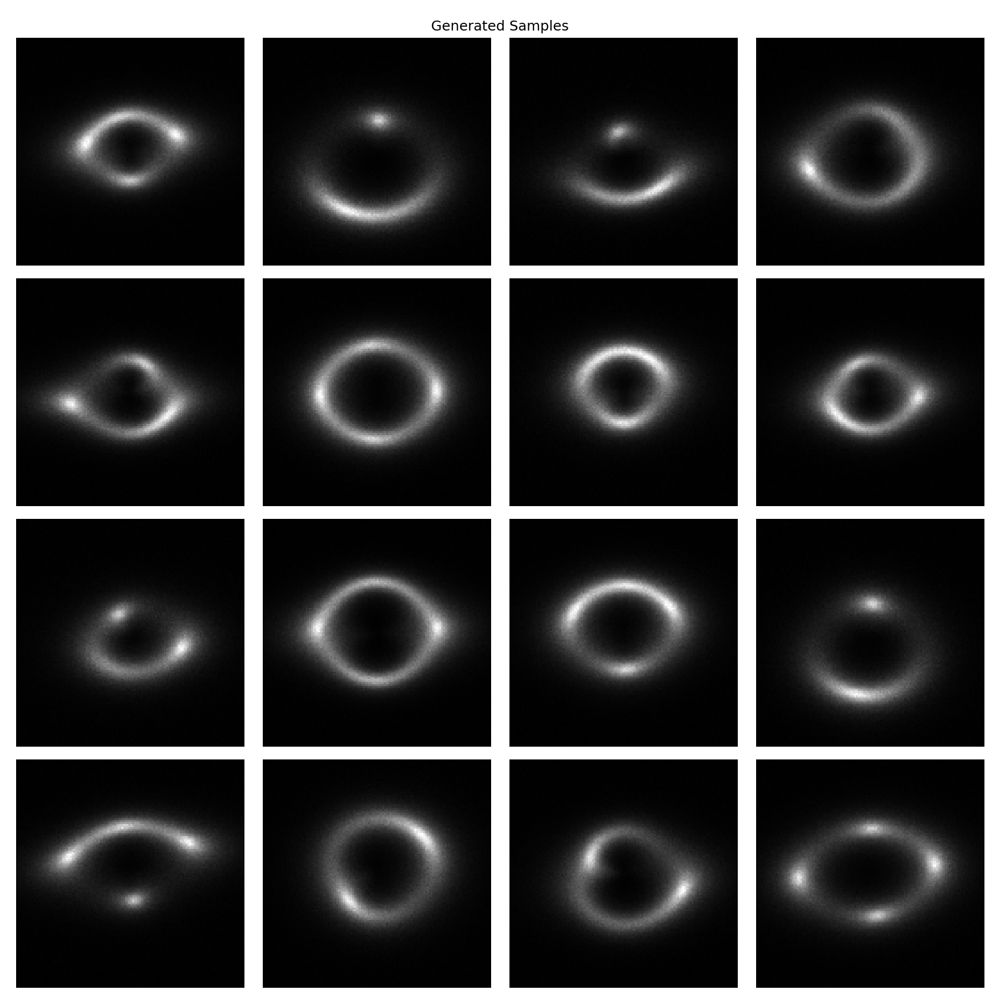
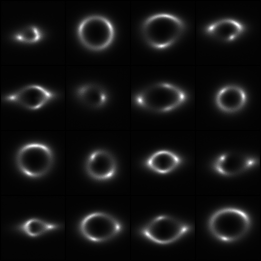
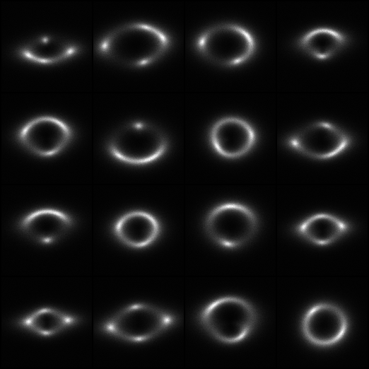
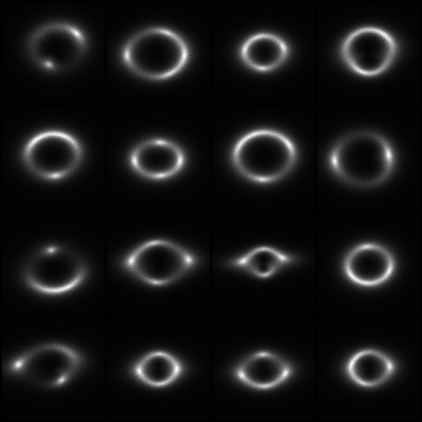

# GSoC 2026 - ML4SCI DeepLense: Specific Test VIII - Diffusion Models

## Overview

This repository contains my solution for the **Specific Test VIII: Diffusion Models** task for the Google Summer of Code 2026 application with ML4SCI's DeepLense project.

**Task:** Develop a generative model to simulate realistic strong gravitational lensing images using a diffusion model (DDPM). Explore various architectures and implementations within the diffusion model framework.

**GSoC Project:** [Physics-Informed Diffusion and Flow Matching Models for Strong Gravitational Lensing](https://ml4sci.org/gsoc/2026/proposal_DEEPLENSE5.html)

---

## Table of Contents

- [Problem Statement](#problem-statement)
- [Dataset](#dataset)
- [Approach](#approach)
- [Model Architecture](#model-architecture)
- [Diffusion Process](#diffusion-process)
- [Training Strategy](#training-strategy)
- [Results](#results)
- [Future Directions: Physics-Informed Diffusion for GSoC](#future-directions-physics-informed-diffusion-for-gsoc)
- [Installation & Usage](#installation--usage)
- [File Structure](#file-structure)
- [References](#references)

---

## Problem Statement

Generate realistic strong gravitational lensing images using a diffusion model. The generated images should be:

1. **Visually realistic** -- indistinguishable from real simulated lensing images
2. **Statistically consistent** -- matching the distribution of the training data
3. **High-fidelity** -- capturing fine-grained lensing features (Einstein rings, arcs, caustics)

**Evaluation Metrics:** Qualitative assessment and Frechet Inception Distance (FID)

---

## Dataset

- **Source:** [Google Drive Dataset](https://drive.google.com/file/d/1cJyPQzVOzsCZQctNBuHCqxHnOY7v7UiA/view)
- **Size:** 10,000 strong gravitational lensing images
- **Original Format:** NumPy arrays (`.npy`), 150x150 pixels, single-channel (grayscale)
- **Preprocessing:** Center-cropped to 128x128, scaled to [0, 1], then auto-normalized to [-1, 1] internally by the diffusion model

---

## Approach

### Why DDPM with Predict-x0?

Denoising Diffusion Probabilistic Models (DDPMs) are well-suited for scientific image generation because they:

- Produce high-quality samples with excellent mode coverage (unlike GANs which suffer from mode collapse)
- Have a stable training objective (simple MSE loss) with no adversarial dynamics
- Allow flexible sampling strategies (DDPM, DDIM) trading off quality for speed

I chose the **predict-x0 objective** (predicting the clean image directly) over the standard noise-prediction objective because:
- It provides more interpretable intermediate outputs during sampling
- SNR-based loss weighting naturally balances contributions across noise levels
- It pairs well with DDIM deterministic sampling for reproducible generation

### Architecture Choice

The UNet backbone uses a compact design (`dim=32`, `dim_mults=(1,2,2,4)`) that is efficient for 128x128 grayscale images. Full self-attention is applied only at the lowest resolution (16x16) to capture global structure, while linear attention at higher resolutions keeps computation manageable. This is important for lensing images where global structures like Einstein rings span the entire image.

---

## Model Architecture

### UNet Backbone

```
Input (1 x 128 x 128) + Time Embedding
       |
       v
┌─────────────────────────────────────────────────────────┐
│  Init Conv: 1 → 32 channels (7x7, padding 3)           │
└─────────────────────┬───────────────────────────────────┘
                      |
     ┌────────────────┼──── Skip Connections ────┐
     |                |                          |
     v                v                          |
┌─────────┐    ┌─────────────┐                   |
│ Down 1  │    │ Time MLP    │                   |
│ 32→32   │    │ Sin → 128-d │                   |
│ 2xResNet│    └─────────────┘                   |
│ LinAttn  │                                     |
│ Downsamp│                                      |
└────┬────┘                                      |
     v                                           |
┌─────────┐                                      |
│ Down 2  │                                      |
│ 32→64   │                                      |
│ 2xResNet│                                      |
│ LinAttn  │                                     |
│ Downsamp│                                      |
└────┬────┘                                      |
     v                                           |
┌─────────┐                                      |
│ Down 3  │                                      |
│ 64→64   │                                      |
│ 2xResNet│                                      |
│ LinAttn  │                                     |
│ Downsamp│                                      |
└────┬────┘                                      |
     v                                           |
┌─────────┐                                      |
│ Down 4  │                                      |
│ 64→128  │                                      |
│ 2xResNet│                                      |
│ FullAttn │  ← Full attention at 16x16          |
└────┬────┘                                      |
     v                                           |
┌──────────────────┐                             |
│    Bottleneck    │                              |
│ ResNet → FullAttn│                              |
│ → ResNet (128ch) │                              |
└────┬─────────────┘                             |
     v                                           |
┌─────────┐                                      |
│  Up 4   │ ←── skip from Down 4 ────────────────┤
│ 128→64  │                                      |
│ 2xResNet│                                      |
│ FullAttn │                                     |
│ Upsample│                                      |
└────┬────┘                                      |
     v                                           |
┌─────────┐                                      |
│  Up 3   │ ←── skip from Down 3 ────────────────┤
│ 64→64   │                                      |
│ 2xResNet│                                      |
│ LinAttn  │                                     |
│ Upsample│                                      |
└────┬────┘                                      |
     v                                           |
┌─────────┐                                      |
│  Up 2   │ ←── skip from Down 2 ────────────────┤
│ 64→32   │                                      |
│ 2xResNet│                                      |
│ LinAttn  │                                     |
│ Upsample│                                      |
└────┬────┘                                      |
     v                                           |
┌─────────┐                                      |
│  Up 1   │ ←── skip from Down 1 ────────────────┘
│ 32→32   │
│ 2xResNet│
│ LinAttn  │
└────┬────┘
     v
┌─────────────────────────────────────────────────────────┐
│  Final: ResNet(64→32) → Conv2d(32→1)                   │
└─────────────────────────────────────────────────────────┘
     |
     v
Output (1 x 128 x 128) - predicted x_0
```

### Component Details

| Component | Specification |
|-----------|--------------|
| **Base dim** | 32 |
| **Channel multipliers** | (1, 2, 2, 4) → channels: 32, 64, 64, 128 |
| **Time embedding** | Sinusoidal positional encoding (dim=32, theta=10000) → MLP (32→128→128) |
| **ResNet blocks** | 2 per stage, GroupNorm(8) + SiLU + Conv2d + time conditioning |
| **Linear attention** | 4 heads, dim_head=32, 4 memory key-values (stages 1-3) |
| **Full attention** | 4 heads, dim_head=32, Flash Attention enabled (stage 4 + bottleneck) |
| **Downsampling** | Rearrange(2x2 patches) → Conv2d (pixel unshuffle) |
| **Upsampling** | Upsample(nearest, 2x) → Conv2d |

---

## Diffusion Process

### Forward Process (Adding Noise)

The forward process gradually adds Gaussian noise to a clean image over T=1000 timesteps:

```
q(x_t | x_0) = N(x_t; sqrt(alpha_bar_t) * x_0, (1 - alpha_bar_t) * I)
```

### Beta Schedule

**Sigmoid schedule** (smoother than linear/cosine for scientific images):

```
t = linspace(0, 1, T+1)
v = sigmoid((t - 0.5) / tau)    # start=-3, end=3, tau=1
betas = clip(1 - alpha_cumprod[1:] / alpha_cumprod[:-1], max=0.999)
```

### Reverse Process (Sampling)

**DDIM sampling** (deterministic, eta=0) with 1000 steps:

```
x_{t-1} = sqrt(alpha_bar_{t-1}) * pred_x0 + sqrt(1 - alpha_bar_{t-1}) * pred_noise
```

### Training Objective

**Predict x_0** (clean image) with SNR-weighted MSE loss:

```
L = E[snr_weight(t) * ||f_theta(x_t, t) - x_0||^2]
```

where `snr(t) = alpha_bar_t / (1 - alpha_bar_t)` provides natural loss weighting across noise levels.

---

## Training Strategy

| Parameter | Value |
|-----------|-------|
| Training Steps | 100,000 |
| Batch Size | 16 |
| Optimizer | Adam (lr=8e-5, betas=(0.9, 0.99)) |
| Gradient Clipping | max_norm=1.0 |
| Mixed Precision | FP16 (AMP) |
| EMA Decay | 0.995 (update every 10 steps) |
| Checkpoints | Every 10,000 steps (10 total) |
| Samples per Checkpoint | 16 (4x4 grid) |
| Framework | Accelerate (HuggingFace) |

---

## Results

### FID Score

| Metric | Score |
|--------|-------|
| **FID (Frechet Inception Distance)** | **3.80** |

FID was computed using 2,500 generated samples compared against the full training set (10,000 images), using Inception-v3 features (2048-d). A score of 3.80 indicates the generated distribution closely matches the real data distribution.

### Generated Samples

**Final samples (100k steps):**



**Training progression (samples at each 10k-step milestone):**

| Milestone | Steps | Sample |
|-----------|-------|--------|
| 1 | 10,000 |  |
| 5 | 50,000 |  |
| 10 | 100,000 |  |

The model learns coarse lensing structure early (by 10k steps) and progressively refines fine details like arc sharpness and background noise texture through the full 100k steps.

---

## Future Directions: Physics-Informed Diffusion for GSoC

The current model is a standard data-driven DDPM with no physics constraints. It generates statistically realistic images but has no guarantee of physical consistency. The GSoC project aims to bridge this gap by making the diffusion process **physics-informed**.

### The Core Problem

A purely data-driven diffusion model can generate images that "look like" lensing but may violate fundamental physics:
- Generated convergence profiles may not correspond to any physical mass distribution
- Arc positions may be inconsistent with the lens equation
- Magnification patterns may not conserve surface brightness

### Direction 1: Physics-Informed Conditioning

Condition the diffusion model on physically meaningful intermediate representations rather than generating images from pure noise:

```
Noise → Denoise conditioned on (κ, γ, θ_E) → Lensing Image
```

- **Convergence map conditioning:** Generate convergence maps first (simpler distribution), then condition image generation on them
- **Parameter conditioning:** Condition on lens parameters (Einstein radius, ellipticity, source position) so the model learns the mapping from physics to images
- **Hierarchical generation:** Physics maps → source galaxy → lensed image (each stage conditioned on the previous)

### Direction 2: Symmetry-Aware Architectures

Gravitational lensing has inherent rotational symmetry. The UNet backbone can be made equivariant:

- **E(2)-equivariant UNet:** Replace standard Conv2d with steerable R2Conv from `escnn`, ensuring the denoising process respects rotational symmetry
- **Group-equivariant attention:** Use rotation-equivariant self-attention at the bottleneck
- **Equivariant time conditioning:** Ensure time embeddings don't break the symmetry of the spatial features

This connects directly to my work in [Specific Test V (Physics-Guided ML)](../Specific_Test_V_Physics_Guided_ML/), where I built E(2)-equivariant encoders for lensing classification.

### Direction 3: Physics Constraints as Loss Terms

Add soft physics constraints to the diffusion training objective:

```
L_total = L_diffusion + lambda_phys * L_physics
```

Possible physics losses:
- **Lens equation consistency:** For generated images, verify that the implied source reconstruction is physically plausible
- **Convergence-shear consistency:** The convergence and shear fields must satisfy the Poisson equation (they are related through second derivatives of the lensing potential)
- **Magnification conservation:** Total magnification must be consistent with the convergence profile
- **Power spectrum matching:** The generated images should match the expected power spectrum of lensing images at all spatial frequencies

### Direction 4: Flow Matching Models

Explore flow matching as an alternative to DDPM:

- **Conditional Flow Matching (CFM):** Simpler training objective, faster sampling, deterministic generation
- **Optimal Transport paths:** Straighter trajectories between noise and data, requiring fewer sampling steps
- **Physics-parameterized flows:** Define the flow field in terms of physical parameters rather than arbitrary noise schedules

### Direction 5: Downstream Task Utility

The ultimate goal is to use generated images to improve downstream classification:

- **Data augmentation:** Generate additional training samples for the 3-class dark matter substructure classifier (connecting to [Common Test I](../common_task/) and [Specific Test V](../Specific_Test_V_Physics_Guided_ML/))
- **Class-conditional generation:** Train a conditional diffusion model that generates images for specific substructure types (no substructure, CDM subhalo, vortex)
- **Sim-to-real transfer:** Generate training data that bridges the gap between simulated and real survey data (HSC-SSP, Euclid)
- **Benchmark against traditional simulations:** Compare generated images against physics-based simulators for both visual quality and downstream classifier performance

### Direction 6: Evaluation Beyond FID

FID measures statistical similarity but not physical consistency. Additional evaluation metrics for physics-informed generation:

- **Physics violation rate:** Fraction of generated images that violate known lensing constraints
- **Parameter recovery:** Can a lens modeling pipeline recover consistent physical parameters from generated images?
- **Downstream AUC improvement:** Does augmenting classifier training with generated images improve ROC-AUC?
- **Power spectrum analysis:** Compare radial power spectra of generated vs. real images

### Proposed GSoC Roadmap

- **Phase 1 -- Class-Conditional DDPM:** Extend the current unconditional model to generate images conditioned on substructure class (no/sphere/vort). Evaluate with per-class FID and downstream classifier improvement.
- **Phase 2 -- Physics Conditioning:** Condition generation on convergence maps and lens parameters. Implement the hierarchical generation pipeline (physics maps → source → lensed image).
- **Phase 3 -- Symmetry-Aware Architecture:** Replace the UNet backbone with an E(2)-equivariant UNet. Benchmark against the standard UNet for generation quality and physical consistency.
- **Phase 4 -- Flow Matching:** Implement Conditional Flow Matching as an alternative to DDPM. Compare training efficiency, sample quality, and physics compliance.
- **Phase 5 -- DeepLense Dataset Deployment:** Train and evaluate on all DeepLense Model datasets. Benchmark against traditional simulators.
- **Phase 6 -- Integration:** Integrate the best model as a data augmentation pipeline for DeepLense classification and regression tasks.

### 7. Deployment on DeepLense Datasets

The current model is trained on the GSoC selection test dataset (10,000 images, single class, Google Drive). During GSoC, the physics-informed diffusion model will be trained and evaluated on the official **DeepLense Model datasets**, which are the actual research targets:

| Dataset | Resolution | Lens Model | Characteristics | Generation Target |
|---------|------------|------------|-----------------|-------------------|
| **Model I** | 150x150 | Sheared Isothermal Elliptical + Sersic | Gaussian PSF, SNR ~25, 3 classes | Class-conditional generation (axion/cdm/no_sub) |
| **Model II** | 64x64 | Sheared Isothermal Elliptical + Sersic | Euclid-like conditions | Augmentation for Euclid-like classification |
| **Model III** | 64x64 | Sheared Isothermal Elliptical + Sersic | HST-like conditions | Augmentation for HST-like classification |
| **Model IV** | Multi-channel | Two Isothermal Elliptical + Real galaxies | Euclid-like, real galaxy sources | Sim-to-real bridge generation |

**Why this matters:** Each DeepLense Model simulates different telescope/survey conditions. A physics-informed diffusion model trained on one model's data should be able to generate physically consistent images for other models by conditioning on the appropriate lens parameters -- this is something a purely data-driven model cannot do.

**Connections to existing DeepLense projects:**

- **Diffusion baselines:** Direct comparison with DeepLense_Diffusion_Hamees and DeepLense_Diffusion_Rishi (class/variable-conditioned diffusion), and Difflense (Aleksandr Duplinskii) for both generation and super-resolution
- **Classification augmentation:** Generated images will augment training data for classification projects (Archil Srivastava, Kartik Sachdev, Saranga Mahanta, Equivariant Networks) on Models I-III. The key metric is whether augmentation with physics-informed generated images improves downstream ROC-AUC
- **Super-resolution synergy:** Physics-informed diffusion can be adapted for conditional super-resolution (low-res to high-res lensing images), connecting to the super-resolution projects (Pranath Reddy, Atal Gupta, Anirudh Shankar)
- **Physics-informed classification:** The physics conditioning pipeline (convergence maps, lens parameters) directly connects to my [Specific Test V (Physics-Guided ML)](../Specific_Test_V_Physics_Guided_ML/) work, where the same SIS lensing physics is used for classification. The diffusion model can generate training data with known physics parameters, enabling better training of the physics-informed classifier
- **Domain adaptation:** Physics-conditioned generation can bridge the sim-to-real gap by generating images that interpolate between simulated conditions (Model I-III) and real survey characteristics (HSC-SSP, Euclid), complementing the domain adaptation work by Marcos Tidball and Mriganka Nath

---

## Installation & Usage

### Requirements

```bash
pip install torch torchvision einops accelerate ema-pytorch torchmetrics numpy pillow matplotlib tqdm
```

### Running the Notebook

1. Download the dataset from [Google Drive](https://drive.google.com/file/d/1cJyPQzVOzsCZQctNBuHCqxHnOY7v7UiA/view)
2. Extract to the dataset directory
3. Update the `data_path` in the notebook
4. Run `image_resolution.ipynb`

### Generating Samples

After training, the model generates samples automatically at each checkpoint. The final 2,500 samples used for FID evaluation are saved in `results/generated_samples.pt`.

---

## File Structure

```
Specific_Test_IV_Diffusion_Models/
├── README.md                          # This file
├── image_resolution.ipynb             # Full implementation notebook
└── results/
    ├── final_samples.png              # 4x4 grid of final generated samples
    ├── generated_samples.pt           # 2,500 generated samples for FID evaluation
    ├── model-1.pt ... model-10.pt     # Training checkpoints (every 10k steps)
    └── sample-1.png ... sample-10.png # Sample grids at each milestone
```

---

## References

1. **DDPM:** Ho, J., Jain, A., & Abbeel, P. "Denoising Diffusion Probabilistic Models." NeurIPS 2020.
2. **DDIM:** Song, J., Meng, C., & Ermon, S. "Denoising Diffusion Implicit Models." ICLR 2021.
3. **FID:** Heusel, M., et al. "GANs Trained by a Two Time-Scale Update Rule Converge to a Local Nash Equilibrium." NeurIPS 2017.
4. **Flow Matching:** Lipman, Y., et al. "Flow Matching for Generative Modeling." ICLR 2023.
5. **E(2)-Equivariant CNNs:** Weiler, M., & Cesa, G. "General E(2)-Equivariant Steerable CNNs." NeurIPS 2019.
6. **DeepLense:** [ML4SCI DeepLense Project](https://github.com/ML4SCI/DeepLense)

---

## Author

**Susmanth Reddy**
GSoC 2026 Applicant -- ML4SCI DeepLense
