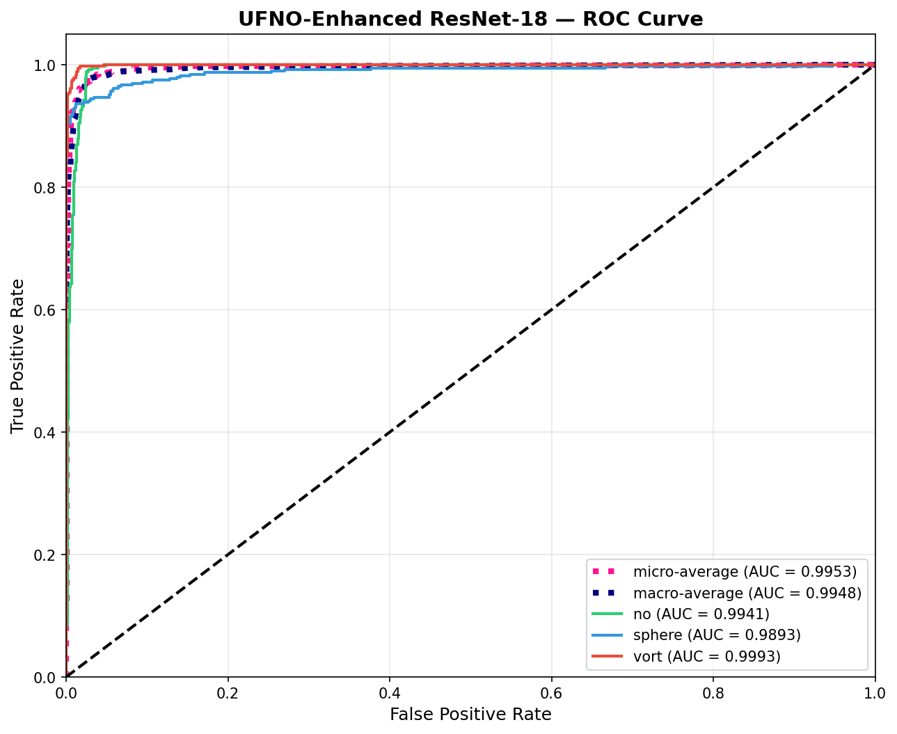
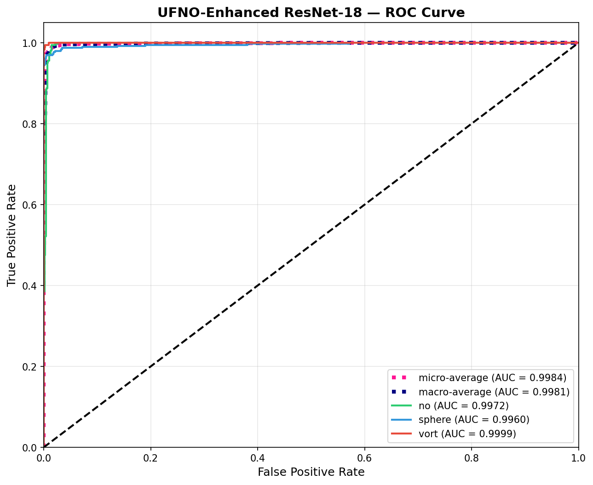

# GSoC 2026 - ML4SCI DeepLense: Specific Test IV - Neural Operators

## Overview

This repository contains my solution for the **Specific Test IV: Neural Operators** task for the Google Summer of Code 2026 application with ML4SCI's DeepLense project.

**Task:** Build a model for classifying gravitational lensing images into three classes using a neural operator architecture as the backbone, replacing or augmenting standard convolutional feature extractors with spectral convolution layers that operate in function space.

**Project:** [Neural Operators for Learning Lensing Maps](https://ml4sci.org/gsoc/2026/proposal_DEEPLENSE5.html)

---

## Table of Contents

- [Problem Statement](#problem-statement)
- [Dataset](#dataset)
- [Approach](#approach)
- [Model Architectures](#model-architectures)
- [Training Strategy](#training-strategy)
- [Results](#results)
- [Comparison with Common Test I](#comparison-with-common-test-i)
- [Discussion](#discussion)
- [Future Directions](#future-directions)
- [Installation & Usage](#installation--usage)
- [File Structure](#file-structure)
- [References](#references)

---

## Problem Statement

Classify strong gravitational lensing images into three categories:
1. **No Substructure** (`no`) -- Strong lensing images without substructure
2. **Spherical Substructure** (`sphere`) -- Images with CDM subhalo substructure
3. **Vortex Substructure** (`vort`) -- Images with vortex/axion substructure

The classifier must use a **neural operator architecture** as the backbone, and performance is compared against the Common Test I baseline.

**Evaluation Metrics:** ROC Curve and AUC Score

---

## Dataset

- **Source:** [Google Drive Dataset](https://drive.google.com/file/d/1QUVUpknFKMKLKvzWz-BWBOnL1Mf8b5tv/view)
- **Format:** NumPy arrays (`.npy` files)
- **Image Size:** 150x150 pixels, single-channel (grayscale)
- **Classes:** 3 (no, sphere, vort) -- balanced
- **Preprocessing:** Min-max normalized
- **Split:** Train (30,000) / Validation (6,375) / Test (1,125)

---

## Approach

### Why Neural Operators for Gravitational Lensing?

Neural operators learn mappings between **function spaces** rather than finite-dimensional vectors. This is fundamentally aligned with gravitational lensing physics:

1. **Physics Connection:** Gravitational lensing maps a continuous mass distribution to a continuous lensed image via the lens equation (a PDE). Neural operators were designed precisely to learn such PDE solution operators. The spectral convolution is conceptually aligned with how lensing distortions manifest in Fourier space.

2. **Global Receptive Field:** Spectral layers process the entire image in the frequency domain from layer 1. Unlike CNNs that build receptive fields gradually through stacking, neural operators capture global structures (lensing arcs, Einstein rings) immediately.

3. **Resolution Invariance:** Neural operators can generalize across input resolutions by spectral zero-padding. A model trained at 150x150 can infer at higher resolution -- critical for real survey data from different telescopes (HSC-SSP, Euclid, Rubin).

4. **Spectral Sparsity:** Lensing images have structured frequency content. The spectral convolution naturally exploits this by operating only on the most informative frequency modes.

### Strategy

Four neural operator architectures are implemented and compared, progressively increasing the use of spectral convolution:

| Model | Approach | Type |
|-------|----------|------|
| **FNO Classifier** | Direct spectral convolution classifier | Pure neural operator |
| **FNO-Enhanced ResNet** | ResNet-18 + parallel spectral branch | Hybrid CNN + spectral |
| **UFNO-Enhanced ResNet** | ResNet-18 + U-shaped spectral branch with skip connections | Hybrid CNN + U-shaped spectral |
| **UFNO Classifier** | Pure U-shaped spectral convolution classifier | Pure neural operator |

---

## Model Architectures

### Model 1: FNO Classifier

Direct adaptation of spectral convolution layers for classification. Uses `SpectralConv` from the official `neuraloperator` library (v2.0.0).

- Lifting layer (1 -> 64 channels) followed by 4 spectral convolution layers (modes=32x32) with residual connections, projection to 128 channels, global average pooling, and a linear classifier.
- Each spectral layer applies FFT, multiplies by learned complex weights in the frequency domain, applies inverse FFT, and adds a 1x1 convolution skip connection.
- **Parameters:** ~8.9M

### Model 2: FNO-Enhanced ResNet (Hybrid)

Pretrained ResNet-18 augmented with a parallel spectral convolution branch after layer1.

- The spectral branch consists of 2 spectral convolution blocks (modes=16x16) with BatchNorm and GELU, projected to 512 channels via strided convolutions.
- The spatial branch continues through ResNet layers 2-4 (512 channels).
- Both branches are fused via addition before global average pooling and classification.
- **Parameters:** ~13.9M

### Model 3: UFNO-Enhanced ResNet (Hybrid)

ResNet-18 augmented with a U-shaped spectral branch that combines spectral convolution with a U-Net encoder-decoder for multi-scale local feature extraction.

- After ResNet layer1, features are lifted and processed by 4 spectral layers:
  - Layers 0-1: spectral convolution + 1x1 convolution (global frequency features)
  - Layers 2-3: spectral convolution + 1x1 convolution + U-Net branch (global + local multi-scale features)
- The U-Net branch provides a 3-level encoder-decoder with skip connections, capturing local spatial structures at multiple scales that complement the global spectral features.
- Projected to 512 channels and fused with ResNet spatial branch via addition.
- **Parameters:** ~15.2M

### Model 4: UFNO Classifier (Pure)

Pure U-shaped spectral convolution classifier without any CNN backbone.

- Lifting stem (strided convolutions to downsample 150x150 -> 38x38) followed by 6 spectral layers:
  - Layers 0-1: spectral convolution + 1x1 convolution
  - Layers 2-5: spectral convolution + 1x1 convolution + U-Net branch
- Global average pooling followed by a 2-layer MLP classifier (width -> 128 -> 3).
- Achieves the best performance among all models despite having no pretrained backbone.
- **Parameters:** ~27.6M

---

## Training Strategy

### Hyperparameters

| Parameter | All Models |
|-----------|-----------|
| Epochs | 150 |
| Batch Size | 64 |
| Optimizer | AdamW |
| Learning Rate | 5e-4 |
| Weight Decay | 0.05 |
| Warmup Epochs | 10 |
| Scheduler | Warmup + CosineAnnealing |
| Early Stopping | Patience 30 (ROC-AUC) |
| Gradient Clipping | max_norm=1.0 |

### Loss Function

**FocalCrossEntropyLoss** -- a blend of smoothed cross-entropy and focal loss:
- 70% CrossEntropyLoss (label_smoothing=0.1) for stable training
- 30% Focal Loss (gamma=2.0) to focus on hard class-boundary samples where substructure differences are subtle

### Data Augmentation

| Augmentation | Parameters |
|-------------|------------|
| Random Horizontal Flip | p=0.5 |
| Random Vertical Flip | p=0.5 |
| Random 90-degree Rotations | {0, 90, 180, 270} |
| Gaussian Noise | sigma in [0, 0.05], p=0.5 |
| Random Brightness | [0.8, 1.2], p=0.5 |
| Random Contrast | [0.8, 1.2], p=0.5 |
| Random Center Crop | [80%, 95%], p=0.3 |

---

## Results

### Performance Comparison

| Model | ROC-AUC (macro) | Accuracy | Parameters |
|-------|----------------|----------|------------|
| FNO Classifier | 0.9717 | 88.31% | ~8.9M |
| FNO-Enhanced ResNet | 0.9888 | 93.54% | ~13.9M |
| UFNO-Enhanced ResNet | 0.9942 | 96.44% | ~15.2M |
| **UFNO Classifier** | **0.9977** | **98.31%** | ~27.6M |
| Common Test I (ESCNN+ResNet) | 0.9882 | 93.71% | ~11.5M |

### Key Findings

- **UFNO Classifier achieves the best performance** (AUC 0.9977, accuracy 98.31%), surpassing all other models including the hybrid approaches and the Common Test I baseline by a significant margin.

- **Progressive improvement with U-shaped architecture:** Adding the U-Net encoder-decoder branch to spectral layers consistently improves performance. The U-Net captures multi-scale local spatial features (edges, arcs, rings at different scales) that complement the global frequency features from spectral convolution.

- **Pure spectral operator outperforms hybrid:** The UFNO Classifier without any pretrained CNN backbone achieves better results than all hybrid models, demonstrating that spectral convolution with multi-scale local processing is sufficient -- and superior -- for lensing image classification.

- **All UFNO models surpass the baseline:** Both UFNO variants significantly outperform the Common Test I baseline (ESCNN+ResNet, AUC 0.9882).

### ROC Curves

**UFNO-Enhanced ResNet:**

**UFNO Classifier:**

---

## Comparison with Common Test I

| Aspect | Common Test I | This Work (Best: UFNO Classifier) |
|--------|--------------|-----------------------------------|
| **Architecture** | ESCNN Canonicalization + ResNet-18 | U-shaped spectral convolution classifier |
| **Best AUC** | 0.9882 | **0.9977** |
| **Best Accuracy** | 93.71% | **98.31%** |
| **Feature Domain** | Spatial (pixel convolutions) | Spectral + multi-scale spatial |
| **Receptive Field** | Local -> global (stacked layers) | Global from layer 1 (full FFT) + multi-scale local (U-Net) |
| **Resolution** | Fixed 150x150 | Resolution-invariant (spectral zero-padding) |
| **Physics Prior** | Rotation equivariance (E(2) symmetry) | Spectral sparsity + multi-scale structure |
| **Pretraining** | ImageNet (ResNet backbone) | From scratch |

The UFNO Classifier **significantly outperforms the Common Test I baseline** (+0.95% AUC, +4.6% accuracy), demonstrating that U-shaped spectral convolution with multi-scale local processing provides superior representations for lensing classification without requiring pretrained weights or explicit symmetry encoding.

---

## Discussion

### Why the U-shaped Spectral Architecture Works Best

1. **Global + Local features:** Spectral convolution captures global frequency patterns (ring structures, arc symmetries) while the U-Net branch captures local multi-scale spatial features (edges, textures, fine substructure details).

2. **Skip connections preserve detail:** The U-Net encoder-decoder with skip connections preserves fine-grained spatial information that would be lost in pure frequency-domain processing.

3. **Progressive complexity:** The architecture processes features through pure spectral layers first (learning global patterns) before introducing the U-Net branch (adding local detail), allowing the model to build representations hierarchically.

4. **No pretrained bias:** Training from scratch allows the model to learn features specifically optimized for lensing images, rather than adapting ImageNet features that may not transfer well to astronomical data.

### Relevance to the GSoC Project

The GSoC project *"Neural Operators for Learning Lensing Maps"* proposes learning the functional mapping: **mass distribution -> lensed image**. The UFNO architecture demonstrated here -- combining spectral convolution with multi-scale spatial processing -- would form an excellent backbone for such operator learning. The strong classification results validate that this architecture can effectively capture the relevant physics of gravitational lensing.

---

## Future Directions

Several advanced neural operator architectures have been explored and implemented as extensions to this work, each addressing a different limitation of the current approach:

### 1. Equivariant Neural Operators

Gravitational lensing images are rotationally symmetric -- rotating a lens image does not change its substructure class. The current U-Shaped FNO is translation-equivariant (via FFT) but not rotation-equivariant. An E(2)-equivariant canonicalization network (ESCNN with C8 symmetry) can be placed before the U-Shaped FNO backbone to first normalize image orientation, then classify. This two-stage approach separates geometric symmetry handling from spectral feature extraction, combining the best of both. A further step would be to design spectral convolution layers that are themselves group-equivariant in the frequency domain (G-FNO), where rotation in the spatial domain corresponds to phase shifts in Fourier space, and the learned weight tensors are constrained to respect these symmetries directly.

### 2. Adaptive Fourier Neural Operator  Token Mixing

The Adaptive Fourier Neural Operator replaces standard self-attention in vision transformers with Fourier-domain token mixing. Instead of computing pairwise attention scores, it processes all spatial tokens globally via FFT, applies block-diagonal complex linear layers with learnable soft-thresholding (sparsification), and returns to the spatial domain via inverse FFT. The block-diagonal structure reduces parameter count while maintaining global receptive field, and the soft-thresholding acts as a learnable frequency filter that keeps only the most informative spectral modes. For gravitational lensing, this is particularly well-suited because lensing arcs and Einstein rings have structured frequency signatures that the AFNO can selectively retain. The architecture is also fully resolution-invariant -- a model trained at 150x150 can infer at arbitrary resolutions without retraining, which is critical for deployment across different telescope surveys (HSC-SSP at one pixel scale, Euclid at another, Rubin/LSST at a third).

### 3. Multiscale Adaptive Neural Operators with Cross-Attention

Gravitational lensing involves structure at multiple spatial scales simultaneously: the large-scale mass distribution of the lens galaxy, the intermediate-scale Einstein ring geometry, and the fine-scale substructure signatures (subhalos, vortices) that distinguish the three classes. A multiscale neural operator architecture addresses this by running two parallel operator branches at different resolutions -- a global operator on a coarser grid captures the large-scale mass distribution context, while a local operator on a finer grid resolves the detailed substructure features. Cross-attention layers allow the local operator to condition on global context at each layer, so fine-scale predictions are informed by the overall lensing geometry. The global operator is trained first and frozen, then the local operator is trained with input noise for robustness. This hierarchical approach with dynamic spectral mode allocation is well-aligned with the physics of lensing, where substructure detection requires understanding both the smooth lens potential and its local perturbations.

### 4. Parallel All-Component Spectral Operator for Resolution Robustness

Real gravitational lensing data comes from telescopes with widely varying pixel scales and image quality -- survey instruments like HSC-SSP, space telescopes like HST/JWST, and future missions like Euclid all produce images at different native resolutions. A parallel-structured spectral operator addresses this by processing all frequency components through multiple parallel branches, each handling different parts of the spectrum. The operator uses resolution-adaptive spectral convolution that can map from any input resolution to a fixed output resolution via flexible inverse FFT sizing, acting as a learned frequency-domain preprocessor before a classification backbone. The model is trained in two phases: first at a base resolution to learn core spectral features, then fine-tuned across multiple resolutions (e.g., 64x64, 128x128, 256x256) to build resolution-invariant representations. This makes it possible to train a single lens classifier that works reliably across data from different surveys without resolution-specific retraining.

### 5. Full Operator Learning

Beyond classification, the ultimate goal for the GSoC project *"Neural Operators for Learning Lensing Maps"* is to learn the functional mapping: **mass distribution -> lensed image**. The U-Shaped FNO architecture demonstrated here -- combining spectral convolution with multi-scale spatial processing via encoder-decoder branches -- would form a strong backbone for this operator learning task. The spectral layers would capture the global lens equation physics while the U-Net branches would resolve the fine-scale image details.

### 6. Uncertainty Quantification

For deployment in real survey pipelines where classification confidence matters, neural operator ensembles or Bayesian variants (e.g., MC Dropout over the spectral layers, deep ensembles of U-Shaped FNO classifiers) can provide calibrated uncertainty estimates. This is essential for identifying ambiguous cases where human expert review is needed, and for propagating classification uncertainty into downstream cosmological analyses.

---

## Installation & Usage

### Requirements

pip install torch torchvision timm scikit-learn matplotlib numpy tqdm
