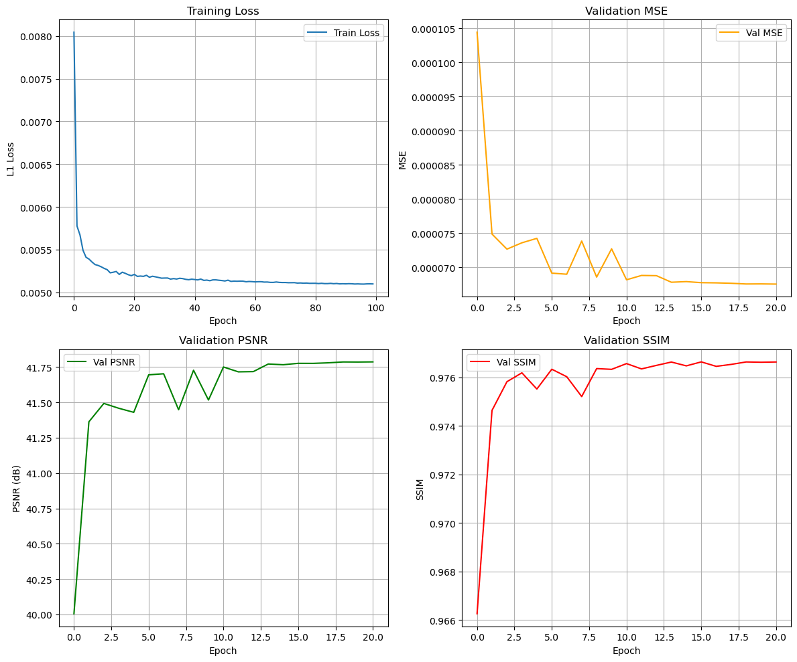
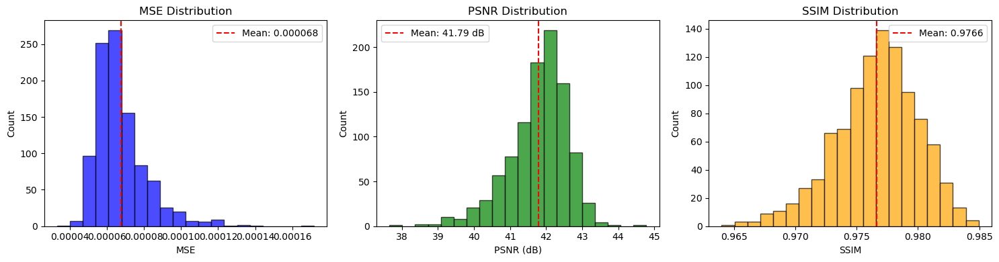
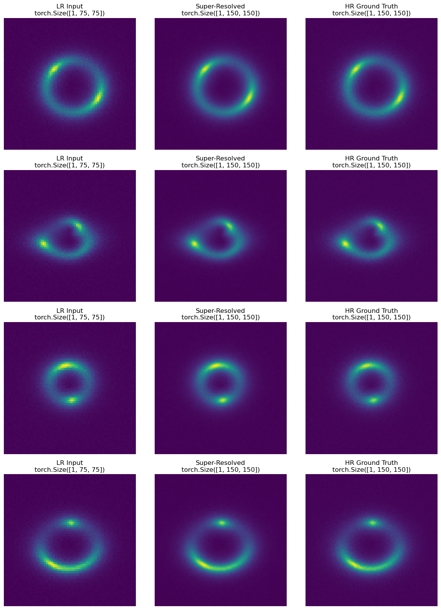
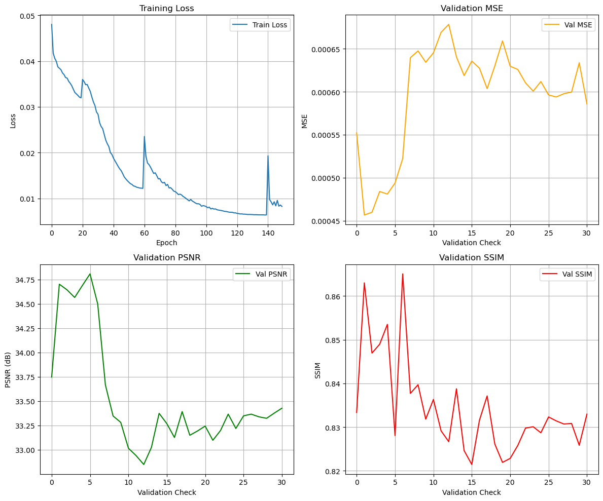
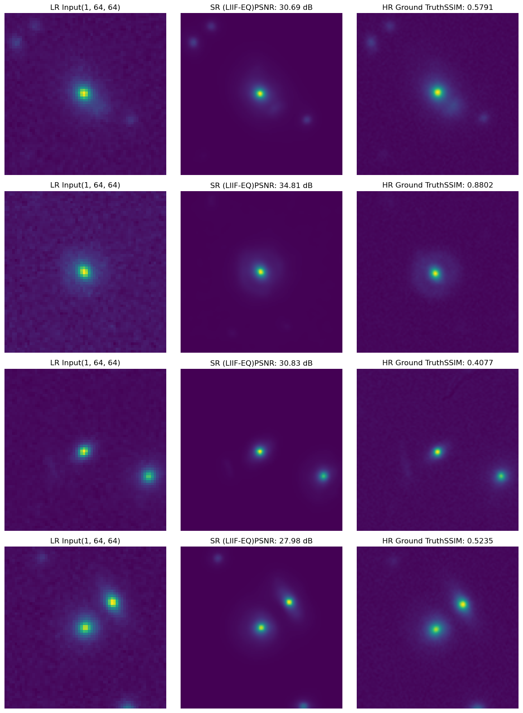

# Arbitrary-Scale Super-Resolution of Strong Gravitational Lensing Images

## What This Is

My solution for the DeepLense GSoC evaluation tasks (Task VI.A and VI.B) on super-resolution of strong gravitational lensing images. Instead of going with the usual fixed-scale SR approaches (RCAN, SRGAN, diffusion models, etc.) that need a separate model for every upscaling factor, I went with LIIF - Local Implicit Image Functions - which learns a continuous representation of the image. You train it once, and it can reconstruct at any resolution. For the real telescope data (Task VI.B), I rebuilt the entire pipeline with rotation equivariant components because lensing images don't have a preferred orientation, and with only 300 training samples, baking that symmetry into the architecture matters a lot more than trying to learn it from augmentation alone.

## Why LIIF Over Fixed-Scale SR

Traditional SR models (EDSR, RCAN, SRGANs) learn a mapping from LR to HR at a specific integer scale - 2x, 4x, etc. If you want a different scale, you retrain. LIIF takes a different approach: the encoder extracts a feature map from the LR image, and then for any query coordinate (x, y), a small MLP predicts the pixel value at that location by looking up the nearest features and combining them with the relative position. This means the model naturally handles arbitrary continuous scales from a single set of weights.

Three mechanisms make this work in practice:

- **Feature unfolding** - each feature pixel gathers its 3x3 neighborhood, so the MLP sees 9x the channels and has richer local context to work with.
- **Local ensemble** - instead of just querying the single nearest feature, we query all 4 nearest neighbors and blend their predictions weighted by inverse area. Gets rid of the blocky grid artifacts you'd otherwise see at feature boundaries.
- **Cell decoding** - the output pixel's cell size gets fed into the MLP alongside the features and coordinates, so the network knows what scale it's reconstructing at.

---

## Task VI.A - Standard LIIF on Simulated Data

10,000 simulated strong lensing image pairs (no substructure), single-channel grayscale. Split 9,000/1,000 for train/test.

### Architecture

```
                        EDSR + LIIF Pipeline

  LR Image (1 x H x W)
       |
       v
  ┌─────────────────────────────────────┐
  │           EDSR Encoder              │
  │                                     │
  │   Conv2d(1 → 64, 3x3)               │
  │          |                          │
  │   16 x ResBlock                     │
  │   ┌───────────────────────┐         │
  │   │  Conv2d(64 → 64, 3x3) │         │
  │   │  ReLU                 │         │
  │   │  Conv2d(64 → 64, 3x3) │         │
  │   │  scale by 0.1         │         │
  │   │  + residual skip      │         │
  │   └───────────────────────┘         │
  │          |                          │
  │   Conv2d(64 → 64, 3x3)              │
  │   + global skip from head           │
  └──────────────┬──────────────────────┘
                 |
                 v
  ┌──────────────────────────┐
  │  Feature Unfold (3x3)    │
  │  64 ch → 576 ch          │
  └────────────┬─────────────┘
               |
               v
  ┌──────────────────────────────────────────┐
  │          Local Ensemble                  │
  │                                          │
  │   For each of 4 nearest feature pixels:  │
  │                                          │
  │     concat [ feature (576)               │
  │              rel_coord (2)               │
  │              cell_size (2) ]             │
  │     = 580-dim vector                     │
  │              |                           │
  │              v                           │
  │     ┌─────────────────────┐              │
  │     │     MLP Decoder     │              │
  │     │  580 → 256 (ReLU)   │              │
  │     │  256 → 256 (ReLU)   │              │
  │     │  256 → 256 (ReLU)   │              │
  │     │  256 → 256 (ReLU)   │              │
  │     │  256 → 1            │              │
  │     └─────────┬───────────┘              │
  │               |                          │
  │   Blend 4 predictions by inverse area    │
  └───────────────┬──────────────────────────┘
                  |
                  v
           SR Pixel Value
```

**Encoder**: EDSR - 16 residual blocks, 64 feature channels, 3x3 kernels, residual scaling 0.1

**Decoder**: Standard MLP - 4 hidden layers of 256 units, ReLU activations

**Total parameters**: ~1.57M

**Training details**:
- Loss: L1
- Optimizer: Adam, lr = 1e-4
- 100 epochs, batch size 16
- 2,304 query points sampled per image
- Mixed precision (AMP) for speed
- Dataset GPU-preloaded

### Results

| Metric | Value |
|--------|-------|
| MSE | 0.000068 |
| PSNR | **41.79 dB** |
| SSIM | **0.9766** |

### Visual Results







Converges smoothly. Per-image PSNR across the 1,000 test images ranges from about 39 dB to 43 dB, with SSIM consistently above 0.97. The single model works at any upscaling factor without retraining - that's the whole point of the implicit representation.

For context, here's how this compares against prior super-resolution results reported in the DeepLense project on simulated lensing data (note: datasets differ across projects, so this isn't a strict apples-to-apples comparison, but it gives a sense of where things stand):

| Method | PSNR | SSIM | Source |
|--------|------|------|--------|
| Bilinear Interpolation | 24.78 dB | 0.303 | Pranath Reddy, GSoC 2023 |
| FSRCNN | 30.45 dB | 0.566 | Pranath Reddy, GSoC 2023 |
| RCAN | 30.50 dB | 0.570 | Pranath Reddy, GSoC 2023 |
| RDN | 30.50 dB | 0.572 | Pranath Reddy, GSoC 2023 |
| EDSR | 30.49 dB | 0.574 | Pranath Reddy, GSoC 2023 |
| SRCNN | 31.76 dB | 0.873 | Atal Gupta, GSoC 2024 |
| RCAN | 32.60 dB | 0.890 | Atal Gupta, GSoC 2024 |
| Iterative AutoEncoder | 33.56 dB | 0.855 | Atal Gupta, GSoC 2024 |
| **LIIF (this work)** | **41.79 dB** | **0.977** | **Task VI.A** |

The ~9 dB gap over the best previously reported result is significant. Part of this likely comes from differences in dataset construction and degradation models, but the LIIF's continuous representation and the combination of feature unfolding + local ensemble + cell decoding clearly contribute to the strong performance.

---

## Task VI.B - Equivariant LIIF on Real HSC/HST Data

300 real strong lensing image pairs from HSC and HST telescopes. Split 270/30 for train/test. This is a fundamentally harder problem - 33x less data, real noise, real PSF variations.

### Why Equivariance

A gravitational lens doesn't care which way is "up." Rotate a lensing image by any angle and the physics is identical. Standard convolutions are only translation equivariant - they don't respect rotations. With 10,000 training images you can sort of brute-force this with augmentation, but with 270 images you really can't. So I replaced every component with its rotation equivariant counterpart:

- All **Conv2d** layers become **Fconv_PCA** - steerable convolutions built from a PCA-based filter basis. One set of learned weights automatically generates all rotated filter versions. The group order is 8 (C8 symmetry, equivariant to 45-degree rotations).
- The MLP's **first layer** becomes **EQ_linear_input** - it takes the 2D query coordinate and rotates it by each of the 8 group angles, then concatenates with the equivariant features. This "lifts" the continuous coordinates into the group representation.
- The MLP's **second layer** becomes **EQ_linear_output** - it pools over the group dimension to produce rotation-invariant features. After this, the remaining layers are standard linear since we're already in invariant space.
- **Feature unfolding** uses Fconv_PCA instead of the standard F.unfold, maintaining equivariance through the unfolding step.

### Architecture

```
                     EDSR-EQ + LIIF-EQ Pipeline

  LR Image (1 x H x W)
       |
       v
  ┌──────────────────────────────────────────────────┐
  │              EDSR-EQ Encoder                     │
  │                                                  │
  │   Fconv_PCA(1 → 16, 5x5)   [lifts to C8 group]   │
  │   output: 16 x 8 = 128 channels                  │
  │          |                                       │
  │   24 x ResBlock-EQ                               │
  │   ┌──────────────────────────────┐               │
  │   │  Fconv_PCA(16 → 16, 5x5)     │  steerable    │
  │   │  ReLU                        │  filters      │
  │   │  Fconv_PCA(16 → 16, 5x5)     │               │
  │   │  scale by 0.1                │               │
  │   │  + residual skip             │               │
  │   └──────────────────────────────┘               │
  │          |                                       │
  │   Fconv_PCA(16 → 16, 5x5)                        │
  │   + global skip from head                        │
  └──────────────────┬───────────────────────────────┘
                     |
                     v
  ┌────────────────────────────────────┐
  │  EQ Feature Unfold (Fconv_PCA)     │
  │  128 ch → 1152 ch                  │
  │  (maintains equivariance)          │
  └──────────────┬─────────────────────┘
                 |
                 v
  ┌───────────────────────────────────────────────────┐
  │            Local Ensemble                         │
  │                                                   │
  │   For each of 4 nearest feature pixels:           │
  │                                                   │
  │     concat [ eq_feature (1152)                    │
  │              rel_coord (2)                        │
  │              cell_size (2 x 8) ]                  │
  │     = 1170-dim vector                             │
  │              |                                    │
  │              v                                    │
  │     ┌───────────────────────────────────────┐     │
  │     │          MLP-EQ Decoder               │     │
  │     │                                       │     │
  │     │  EQ_linear_input                      │     │
  │     │    rotate (x,y) by 8 group angles     │     │
  │     │    concat with equivariant features   │     │
  │     │    equivariant linear transform       │     │
  │     │              |                        │     │
  │     │  ReLU + Dropout(0.1)                  │     │
  │     │              |                        │     │
  │     │  EQ_linear_output                     │     │
  │     │    pool over C8 group → invariant     │     │
  │     │              |                        │     │
  │     │  Linear(256 → 256) + ReLU             │     │
  │     │  Linear(256 → 256) + ReLU             │     │
  │     │  Linear(256 → 1)                      │     │
  │     └──────────────┬────────────────────────┘     │
  │                    |                              │
  │   Blend 4 predictions by inverse area             │
  └────────────────────┬──────────────────────────────┘
                       |
                       v
                SR Pixel Value
```

**Encoder**: EDSR-EQ - 24 residual blocks, 128 feature channels (16 per group element x 8), 5x5 steerable kernels, residual scaling 0.1

**Decoder**: Hybrid MLP-EQ - hidden layers [1024, 512, 256, 256], equivariant input/output layers with standard linear layers in between, dropout 0.1

**Total parameters**: ~3.39M

**Training details**:
- Loss: 0.84 x L1 + 0.16 x SSIM
- Optimizer: AdamW, lr = 1e-4, weight decay = 5e-5
- Scheduler: Cosine annealing with warm restarts (T_0=20, T_mult=2)
- 200 epochs, batch size 4
- 4,096 query points sampled per image
- Transfer learning from Task VI.A weights (compatible tensors loaded)
- 16x data augmentation (random 90/180/270 rotations, H/V flips, transpose, intensity scaling 0.9-1.1, Gaussian noise on LR)
- Effective training set: 270 x 16 = 4,320 samples

### Results

| Metric | Value |
|--------|-------|
| MSE | 0.000494 |
| PSNR | **34.81 dB** |
| SSIM | **0.8281** |

### Visual Results





34.81 dB from 270 real telescope images is a solid result. The equivariant architecture doesn't need to waste capacity learning that rotated inputs should give rotated outputs - that's guaranteed by construction. The combined L1+SSIM loss helps with perceptual quality, and the warm restart scheduler helps the model escape local minima during the long training run.

There's no direct prior work in DeepLense on this specific 300-pair real HSC/HST dataset for comparison. The closest reference point is Anirudh Shankar's physics-informed unsupervised SR (GSoC 2024), which achieved SSIM of 0.66-0.82 on different real-ish lensing data depending on the model and substructure type. Our 0.8281 SSIM from just 270 supervised training samples, without any physics-informed losses, suggests there's still headroom - especially once we move toward the unsupervised and physics-informed directions planned for the GSoC project.

---

## Side-by-Side Comparison

| | Task VI.A | Task VI.B |
|---|---|---|
| **Dataset** | Simulated, 10,000 pairs | Real HSC/HST, 300 pairs |
| **Architecture** | EDSR + LIIF | EDSR-EQ + LIIF-EQ |
| **Equivariance** | None | C8 (45-degree rotations) |
| **Encoder** | 16 ResBlocks, 64ch, 3x3 | 24 ResBlocks, 128ch, 5x5 steerable |
| **Decoder** | MLP [256,256,256,256] | MLP-EQ [1024,512,256,256] |
| **Parameters** | 1.57M | 3.39M |
| **Loss** | L1 | L1 + SSIM |
| **Optimizer** | Adam | AdamW + cosine warm restarts |
| **Augmentation** | None | 16x (rotations, flips, noise) |
| **Transfer learning** | No | Yes (from Task VI.A) |
| **MSE** | 0.000068 | 0.000494 |
| **PSNR** | 41.79 dB | 34.81 dB |
| **SSIM** | 0.9766 | 0.8281 |

The gap in metrics between the two tasks is expected and comes down to the data: 10,000 clean simulated images vs 270 noisy real telescope images. The equivariant model is doing a lot of heavy lifting to get 34.81 dB out of that little data.

---

## Future Directions

The architecture I built is modular - the encoder and decoder are independent components that can be swapped. This opens up a clear roadmap for the GSoC project.

### Better Encoders

The current EDSR/EDSR-EQ encoder is a stack of residual blocks with local 3x3 or 5x5 receptive fields. Lensing arcs and Einstein rings are large-scale structures that span significant portions of the image. A few directions that would help:

**Swin Transformer encoder (SwinIR)** - uses shifted window self-attention to capture long-range dependencies. Each attention layer sees a much larger context than a convolution kernel. This should help the model understand the global arc/ring geometry instead of just local texture. An equivariant version (SwinIR-EQ) where all linear layers and convolutions are replaced with their equivariant counterparts would be the strongest option for real data.

**Residual Dense Network (RDN)** - uses dense connections within each residual block so every convolution layer receives feature maps from all preceding layers. This kind of aggressive feature reuse captures richer local detail and has already been shown to work well for lensing SR in prior DeepLense work.

**Residual Channel Attention (RCAN)** - adds channel attention mechanisms that let the network learn which feature channels are most informative. For lensing images where faint arc features coexist with bright central galaxies, this selective focus could help a lot.

### Better Decoders

The current LIIF decoder concatenates features with coordinates and feeds them through an MLP. This works, but it treats coordinates as just another input dimension. Better alternatives exist:

**Local Texture Estimator (LTE)** - instead of raw coordinate concatenation, LTE learns separate coefficient and frequency maps from the encoder features, then constructs a Fourier basis from the query coordinates. The MLP input becomes a product of learned coefficients and coordinate-dependent basis functions. This captures local texture patterns - the fine striations in lensing arcs, the intensity gradients near critical curves - much more faithfully than vanilla LIIF. An equivariant version (LTE-EQ) with steerable convolutions for the coefficient/frequency extraction and equivariant linear layers for the phase computation is the natural next step.

**Orthogonal Position Encoding (OPE)** - replaces raw coordinate concatenation with orthogonal basis functions, which may generalize better across different scale factors. The equivariant version (OPE-EQ) handles coordinate transformation through the group structure.

### Toward Unsupervised SR

The GSoC project's main goal is unsupervised super-resolution - not needing HR ground truth at all. The current supervised pipeline is a starting point. The path forward:

**Physics-informed losses** - the lensing equation relates source, image, and deflection angle. If we add a branch that estimates the deflection angle from the encoder features, we can impose physical constraints (deflection angle smoothness, intensity conservation between source and image, non-negativity of mass distribution) as loss terms. This has already been demonstrated in DeepLense by Anirudh Shankar's work, and integrating it with the LIIF framework would let us do physics-informed arbitrary-scale SR.

**Sim-to-real domain adaptation** - train the full pipeline on the large simulated dataset (where we have plenty of HR/LR pairs), then adapt to real telescope images using adversarial domain adaptation or style transfer. The equivariant architecture should make this transfer smoother since both domains share the same rotational symmetry.

### Lens Characterization

The encoder features already contain rich information about the lensing system. Adding a lightweight branch that predicts lens properties (Einstein radius, ellipticity, velocity dispersion, mass profile parameters) from these features would turn the SR pipeline into a joint SR + lens analysis tool. This directly addresses the GSoC project's second goal of obtaining insight about the lenses themselves.

### Encoder-Decoder Combinations Worth Trying

The modular design means any encoder pairs with any decoder. The most promising untested combinations, roughly in order of expected impact:

| Encoder | Decoder | Why |
|---------|---------|-----|
| SwinIR | LTE | Transformer global context + texture-aware decoding |
| SwinIR-EQ | LTE-EQ | Full equivariant SOTA - best bet for real data |
| EDSR | LTE | Just swap the decoder, keep the encoder - quick experiment |
| EDSR-EQ | LTE-EQ | Equivariant texture estimation on existing encoder |
| RDN | LIIF | Dense features for richer local context |
| RCAN | LIIF | Channel attention for distinguishing faint features |
| EDSR-EQ | OPE-EQ | Orthogonal position encoding with equivariance |

### Deployment on DeepLense Datasets

The current results are on the GSoC selection test datasets (Task VI.A: 10,000 simulated pairs; Task VI.B: 300 real HSC/HST pairs). During GSoC, this architecture will be deployed on the official DeepLense Model datasets for super-resolution:

| Dataset | Resolution | Characteristics | SR Relevance |
|---------|------------|-----------------|-------------|
| **Model I** | 150x150 | Gaussian PSF, SNR ~25 | Simulated LR/HR pairs for benchmarking |
| **Model II** | 64x64 | Euclid-like conditions | Low-res Euclid-like images to super-resolve |
| **Model III** | 64x64 | HST-like conditions | HST-like degradation model |
| **Model IV** | Multi-channel | Real galaxy sources, Euclid-like | Multi-channel SR with real morphologies |
| **HSC-SSP / Euclid** | Varies | Real survey data | Ultimate deployment target for real SR |

The equivariant LIIF architecture is particularly well-suited for deployment across these datasets because: (1) the arbitrary-scale capability means a single model handles any LR-to-HR ratio without retraining, and (2) the rotation equivariance is exact regardless of the telescope or survey conditions.

**Connections to existing DeepLense projects:**

- **SR benchmarks:** Direct comparison with Pranath Reddy (EDSR, RCAN, RDN on Model I/IV), Atal Gupta (SRCNN, RCAN, diffusion SR), and Difflense (Aleksandr Duplinskii) for both simulated and real data
- **Physics-informed SR:** Extends Anirudh Shankar's physics-informed unsupervised SR with the LIIF continuous representation -- combining physics constraints with arbitrary-scale reconstruction
- **Grid-based SR:** Anirudh Shankar's grid-based lensing approach on Model IV can be integrated with LIIF's implicit representation for a physics-aware continuous SR pipeline
- **Diffusion SR synergy:** The diffusion model from my [Specific Test IV](../Specific_Test_IV_Diffusion_Models/) can generate additional training pairs for the SR model, and conversely, the SR model can upscale diffusion-generated images for higher-fidelity augmentation
- **Classification improvement:** Super-resolved images from Model II/III can be fed into classification pipelines (connecting to my [Specific Test V Physics-Guided ML](../Specific_Test_V_Physics_Guided_ML/) and [Common Task](../common_task/)) to test whether higher-resolution inputs improve substructure classification AUC

---

## References

1. Chen, Y., Liu, S., & Wang, X. (2021). Learning Continuous Image Representation with Local Implicit Image Function. CVPR 2021.
2. Lee, J., Jin, K. H. (2022). Local Texture Estimator for Implicit Representation Function. CVPR 2022.
3. Liang, J., et al. (2021). SwinIR: Image Restoration Using Swin Transformer. ICCV Workshops 2021.
4. Weiler, M. & Cesa, G. (2019). General E(2)-Equivariant Steerable CNNs. NeurIPS 2019.
5. Lim, B., et al. (2017). Enhanced Deep Residual Networks for Single Image Super-Resolution. CVPR Workshops 2017.
6. Alexander, S., et al. (2020). Deep Learning the Morphology of Dark Matter Substructure. The Astrophysical Journal.
