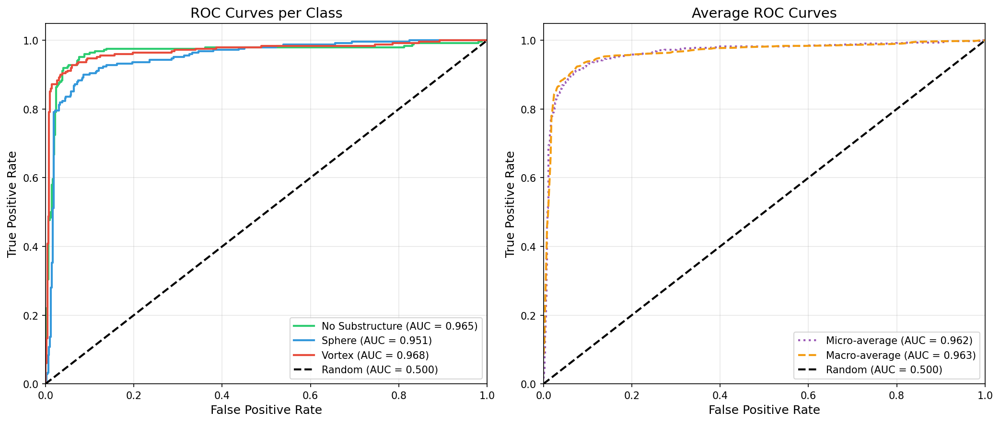
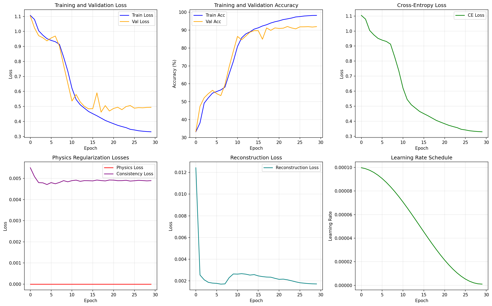
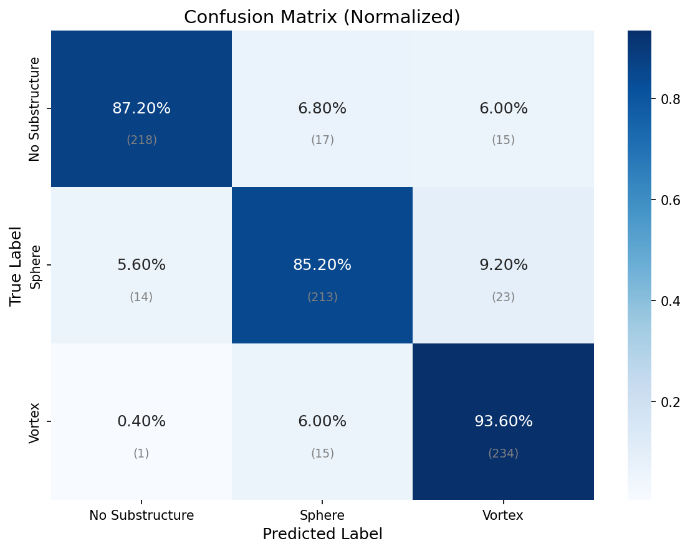
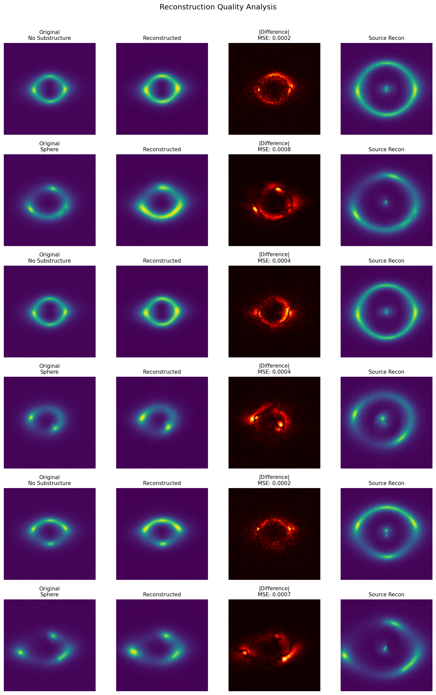
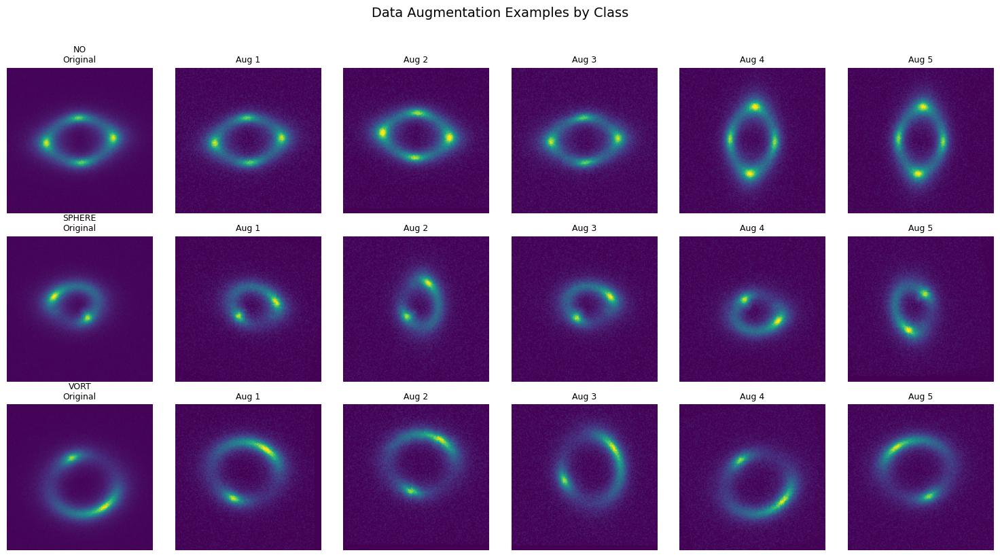
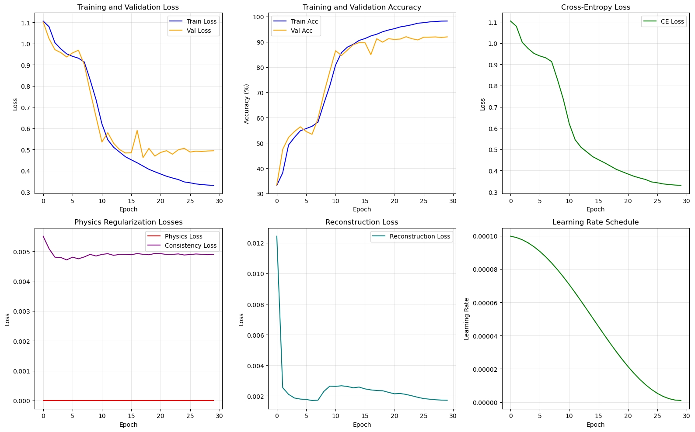
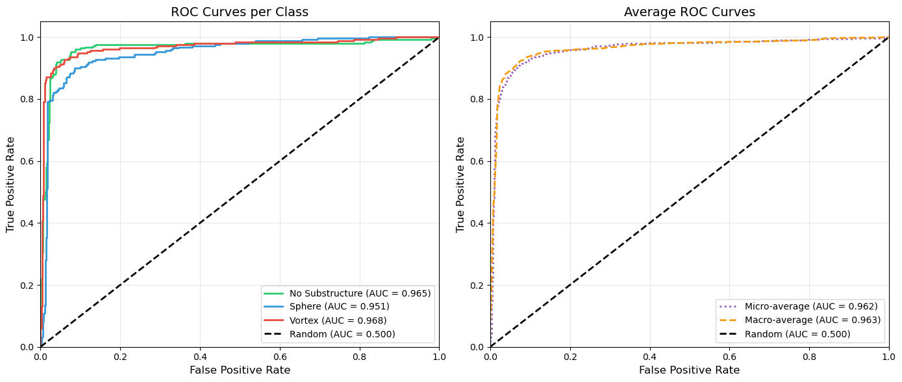
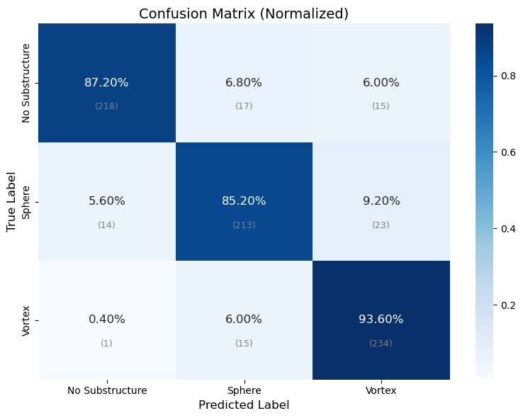
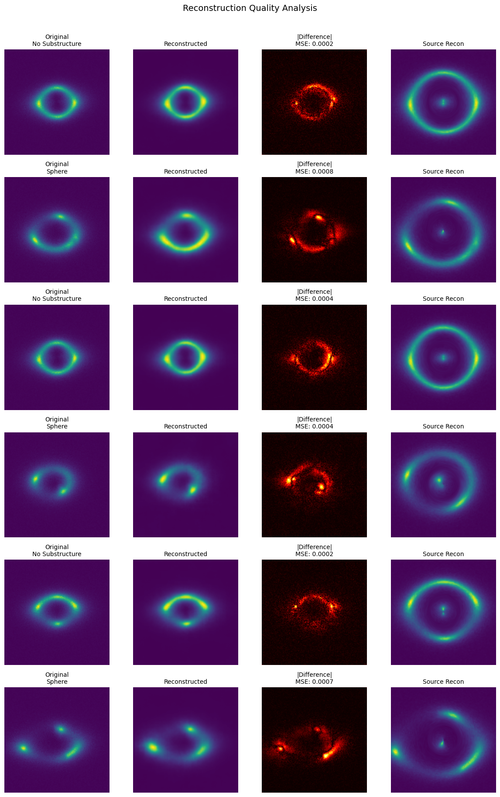

# GSoC 2026 - ML4SCI DeepLense: Specific Test V - Physics-Guided ML

## Overview

This repository contains my solution for the **Specific Test V: Physics-Guided Machine Learning** task for the Google Summer of Code 2026 application with ML4SCI's DeepLense project.

**Task:** Build a Physics-Informed Neural Network (PINN) for classifying strong gravitational lensing images, incorporating the gravitational lensing equation directly into the architecture to improve classification over the Common Test baseline.

**Project:** [Gravitational Lens Finding](https://ml4sci.org/gsoc/2026/proposal_DEEPLENSE5.html)

---

## Table of Contents

- [Problem Statement](#problem-statement)
- [Dataset](#dataset)
- [Approach](#approach)
- [Model Architecture](#model-architecture)
- [Physics Integration](#physics-integration)
- [Training Strategy](#training-strategy)
- [Results](#results)
- [Comparison with Reference Implementation](#comparison-with-reference-implementation)
- [Future Directions](#future-directions)
- [Installation & Usage](#installation--usage)
- [File Structure](#file-structure)
- [References](#references)

---

## Problem Statement

Classify strong gravitational lensing images into three categories using a physics-informed architecture:

1. **No Substructure** (`no`) -- Strong lensing images without substructure
2. **Spherical Substructure** (`sphere`) -- Images with CDM subhalo substructure
3. **Vortex Substructure** (`vort`) -- Images with vortex/axion substructure

The architecture must take the form of a **Physics-Informed Neural Network (PINN)**, using the gravitational lensing equation to improve performance over a standard classifier.

**Evaluation Metrics:** ROC Curve and AUC Score

---

## Dataset

- **Source:** [Google Drive Dataset](https://drive.google.com/file/d/1QUVUpknFKMKLKvzWz-BWBOnL1Mf8b5tv/view)
- **Format:** NumPy arrays (`.npy` files)
- **Image Size:** 150x150 pixels, single-channel (grayscale)
- **Classes:** 3 (no, sphere, vort) -- balanced
- **Preprocessing:** Min-max normalized
- **Split:** Train / Validation (90%) / Test (10% of validation)

---

## Approach

### Why Physics-Informed + Equivariant?

Standard classifiers treat lensing images as generic pixel grids, ignoring the underlying physics. My approach embeds two key physical priors directly into the network:

1. **Gravitational lensing equations (SIS model):** The Singular Isothermal Sphere lens model is differentiable and embedded in the forward pass. The network learns to predict the Einstein radius, compute convergence/shear/magnification maps, and reconstruct the unlensed source -- all as intermediate representations that feed into classification.

2. **Rotational equivariance (E(2)-CNN):** Gravitational lensing is rotationally symmetric -- rotating a lens image does not change its dark matter substructure class. Using steerable convolutions from `escnn` with C8 cyclic symmetry, the equivariant encoders guarantee that rotated inputs produce correspondingly rotated features, eliminating the need to learn rotation invariance from data.

### Inspiration

This work is inspired by **Ashutosh Ojha's LensPINN** (DeepLense), which pioneered the idea of embedding differentiable lensing inversion into the forward pass of a classifier. My contribution extends this by:

- Replacing standard CNN encoders with **E(2)-equivariant steerable encoders** (C8 symmetry)
- Using **cross-attention fusion** instead of simple concatenation for multi-stream features
- Computing **explicit physics maps** (convergence, shear, magnification, deflection) as intermediate features
- Adding **physics-aware data augmentation** and **multi-term loss functions** (physics + consistency + reconstruction)
- A separate **hybrid variant** adds a pretrained ResNet18 backbone as a 4th stream for comparison

---

## Model Architecture

The primary model (`PhysicsInformedEquivariantLensNet` in the notebook) uses a **3-stream E2-equivariant fusion** architecture. All three encoders are E(2)-equivariant steerable CNNs -- no pretrained backbone is used, making the entire pipeline physics-informed and symmetry-aware from end to end.

```
                              ┌──────────────────────┐
                              │   Input Image         │
                              │   (1 x 150 x 150)     │
                              └──────────┬───────────┘
                                         │
                    ┌────────────────────┼────────────────────┐
                    │                    │                    │
                    ▼                    ▼                    ▼
         ┌──────────────────┐  ┌─────────────────┐  ┌───────────────────┐
         │  Einstein Radius  │  │  SIS Lensing    │  │  Source           │
         │  Predictor (CNN)  │  │  Physics Module │  │  Reconstruction   │
         └────────┬─────────┘  └────────┬────────┘  │  (Ray-Tracing)    │
                  │                     │            └────────┬──────────┘
                  │                     ▼                     │
                  │            Physics Maps (5ch)             ▼
                  │            κ, γ₁, γ₂, μ, |α|      Source Image (1ch)
                  │                     │                     │
                  ▼                     │                     │
                  │    ┌────────────────┼─────────────────────┤
                  │    │                │                     │
                  │    ▼                ▼                     ▼
                  │  ┌──────────┐  ┌──────────┐        ┌──────────┐
                  │  │ Stream 1 │  │ Stream 2 │        │ Stream 3 │
                  │  │ E2-Equiv │  │ E2-Equiv │        │ E2-Equiv │
                  │  │ Encoder  │  │ Encoder  │        │ Encoder  │
                  │  │ (256-d)  │  │ (128-d)  │        │ (128-d)  │
                  │  └────┬─────┘  └────┬─────┘        └────┬─────┘
                  │       │             │                    │
                  │       └──────┬──────┴────────────────────┘
                  │              │
                  │              ▼
                  │    ┌──────────────────┐
                  │    │  Cross-Attention │
                  │    │     Fusion       │
                  │    │    (512-d)       │
                  │    └────────┬─────────┘
                  │             │
                  │  ┌──────────┴──────────┐
                  │  │                     │
                  │  ▼                     ▼
                  │  ┌──────────────────┐  ┌──────────────────┐
                  │  │    Ensemble       │  │  Reconstruction  │
                  │  │   Classifier      │  │    Decoder       │
                  │  │  (3 heads avg)    │  │  (ConvTranspose) │
                  │  └──────────────────┘  └──────────────────┘
                  │           │                     │
                  │           ▼                     ▼
                  │    3-class logits        Reconstructed image
                  │   (no/sphere/vort)        (self-supervised)
                  │
                  └──── Einstein radius (used by physics module + loss)
```

### Stream Details

| Stream | Input | Encoder | Output Dim | Purpose |
|--------|-------|---------|------------|---------|
| 1 | Raw image | E2-Equivariant CNN (C8) | 256 | Rotation-invariant image features |
| 2 | Physics maps (5-ch: κ, γ₁, γ₂, μ, \|α\|) | E2-Equivariant CNN (C8) | 128 | Rotation-invariant lensing physics features |
| 3 | Reconstructed source | E2-Equivariant CNN (C8) | 128 | Rotation-invariant source morphology features |

> **Note:** A 4-stream hybrid variant (`HybridPhysicsInformedLensNet` in `hybrid_resnet_equivariant_model.py`) adds a pretrained ResNet18 backbone as a fourth stream (512-d) for transfer learning. This is provided as an alternative architecture for future comparison.

### E2-Equivariant Encoder

Each equivariant encoder uses steerable convolutions from `escnn` with C8 cyclic symmetry (8 discrete rotations of 45 degrees):

```
Input → MaskModule → R2Conv(→24 reg) → BN → ReLU
     → R2Conv(→48 reg) → BN → ReLU → AvgPool(stride=2)
     → R2Conv(→48 reg) → BN → ReLU
     → R2Conv(→64 reg) → BN → ReLU → AvgPool(stride=2)
     → R2Conv(→64 reg) → BN → ReLU → AvgPool(stride=2) → AvgPool(stride=2)
     → GroupPooling → Linear → LayerNorm → ReLU → output_features
```

### Cross-Attention Fusion

Rather than simple concatenation, the 4 feature streams are fused using multi-head attention:

1. Each stream is projected to a common hidden dimension
2. Self-attention across all streams captures inter-stream relationships
3. Per-stream cross-attention refines each stream using information from the others
4. Concatenated refined features are projected to the final fused dimension (512)

### Ensemble Classifier

Three independent classification heads (Linear→LN→ReLU→Dropout→Linear→LN→ReLU→Dropout→Linear) whose logits are averaged for the final prediction, providing implicit regularization.

---

## Physics Integration

### Gravitational Lensing Equation (SIS Model)

The **Singular Isothermal Sphere** (SIS) lens model is embedded as a differentiable module in the forward pass. Given an observed lensing image, the network:

1. **Predicts the Einstein radius** `θ_E` using a small CNN predictor (Conv→BN→ReLU→Pool→FC→Softplus + 0.5 offset)

2. **Computes 5 physics channels** from the SIS model on an angular coordinate grid:

   | Channel | Formula | Physical Meaning |
   |---------|---------|------------------|
   | Convergence `κ` | `θ_E / (2r)` | Surface mass density (normalized) |
   | Shear `γ₁` | `(θ_E / 2r) cos(2φ)` | Tidal gravitational field component |
   | Shear `γ₂` | `(θ_E / 2r) sin(2φ)` | Tidal gravitational field component |
   | Magnification `μ` | `1 / |(1-κ)² - |γ|²|` | Flux amplification factor |
   | Deflection `|α|` | `θ_E` | Deflection angle magnitude |

3. **Reconstructs the source** via differentiable ray-tracing using the lens equation `β = θ - α(θ)`:
   - Deflection field: `α_x = θ_E · x/r`, `α_y = θ_E · y/r`
   - Source positions mapped via `F.grid_sample` with bilinear interpolation
   - Fully differentiable, allowing gradients to flow through the physics

### How Physics Improves Classification

The physics module provides the classifier with **physically meaningful intermediate representations**:

- **Convergence maps** highlight where mass is concentrated -- different for CDM subhalos vs. axion vortices
- **Shear maps** encode the tidal distortion pattern -- sensitive to substructure morphology
- **Source reconstruction** removes the lensing effect, revealing the underlying source galaxy -- differences between the lensed and unlensed image encode the lens properties
- The **Einstein radius** itself is a learned physical parameter that the network optimizes jointly with classification

---

## Training Strategy

### Hyperparameters

| Parameter | Value |
|-----------|-------|
| Epochs | 30 |
| Batch Size | 32 |
| Learning Rate | 1e-4 |
| Optimizer | AdamW |
| Weight Decay | 1e-5 |
| Scheduler | CosineAnnealingLR |
| Gradient Clipping | max_norm=1.0 |
| Label Smoothing | 0.1 |

### Loss Function

**Multi-term physics-informed loss:**

```
L_total = L_CE + λ_phys × L_physics + λ_cons × L_consistency + λ_recon × L_reconstruction
```

| Term | Description | Purpose |
|------|-------------|---------|
| `L_CE` | CrossEntropyLoss with label smoothing (0.1) | Classification objective |
| `L_physics` | Einstein radius regularization -- penalizes values outside [0.5, 2.0] arcsec | Keeps learned physics parameter in physically valid range |
| `L_consistency` | Source should be smoother than lensed image (total variation comparison) | Enforces physical prior that lensing adds structure |
| `L_reconstruction` | MSE + structural similarity (avg-pool based) between reconstructed and original | Self-supervised signal for feature learning |

> **Note:** The hybrid script variant (`hybrid_resnet_equivariant_model.py`) uses a simplified loss: `L_CE + 0.2 × L_reconstruction` only.

### Physics-Aware Data Augmentation

| Augmentation | Parameters | Physics Justification |
|--------------|------------|----------------------|
| 90-degree rotations | {0, 90, 180, 270} | Exact rotational symmetry of lensing |
| Small rotations | +/-15 degrees | Approximate continuous rotation |
| Horizontal/Vertical flip | p=0.5 | Reflection symmetry |
| Brightness adjustment | [0.9, 1.1] | Simulates flux variations |
| Contrast adjustment | [0.9, 1.1] | Simulates noise/background variations |
| Gaussian noise | sigma=0.02 | Simulates detector noise |
| Small translation | up to 5% | Slight off-center lenses |

---

## Results

### Performance (3-Stream E2-Equivariant PINN)

**Test Set (750 samples):**

| Metric | Score |
|--------|-------|
| **Best Validation Accuracy** | **92.01%** |
| Test Accuracy | 88.67% |
| Test Loss | 0.5745 |
| Total Parameters | 19,039,651 |

**Per-Class Performance:**

| Class | Precision | Recall | F1-Score |
|-------|-----------|--------|----------|
| No Substructure | 0.94 | 0.87 | 0.90 |
| Sphere | 0.87 | 0.85 | 0.86 |
| Vortex | 0.86 | 0.94 | 0.90 |
| **Macro Average** | **0.89** | **0.89** | **0.89** |

**AUC Scores:**

| Class | AUC |
|-------|-----|
| No Substructure | 0.9653 |
| Sphere | 0.9506 |
| Vortex | 0.9684 |
| **Micro-Average** | **0.9622** |
| **Macro-Average** | **0.9629** |

### ROC Curve



### Training History



### Confusion Matrix



### Reconstruction Quality

The model learns to reconstruct the original image from fused features as a self-supervised auxiliary task. The source reconstruction via ray-tracing is also visualized:



---

## Comparison with Reference Implementation

| Aspect | Ashutosh Ojha (LensPINN) | This Work |
|--------|--------------------------|-----------|
| **Physics model** | SIS lensing (same) | SIS lensing (same) |
| **Lensing integration** | Differentiable inversion in forward pass | Differentiable inversion + physics maps as features |
| **Encoder type** | Standard CNN (EfficientNet/MobileNet) | E(2)-Equivariant steerable CNNs (C8) |
| **Rotational symmetry** | Not explicitly encoded | Built-in via `escnn` steerable convolutions |
| **Backbone** | EfficientNet-B0 / MobileNetV3 | 3 E2-equivariant encoders (no pretrained backbone) |
| **Fusion** | Feature concatenation | Cross-attention fusion |
| **Physics loss** | None (physics only in forward pass) | Einstein radius regularization + consistency |
| **Distortion input** | Preprocessed (log-square-gradient-tanh) | Raw physics maps (kappa, gamma, mu, alpha) |
| **Streams** | 2 (image + distortion) | 3-4 (image + physics maps + source + optional backbone) |
| **Best F1 (large dataset)** | 0.999 (LensPINN_large) | -- (different dataset) |
| **AUC (this dataset)** | -- | 0.9629 (macro) |

### Key Differences in Physics Approach

- **Ojha** uses a hand-crafted preprocessing pipeline (`log(I_max/I)^2 → gradient → tanh → abs`) to create a "distortion" map, then feeds it alongside the image. The Einstein angle is learned per-pixel or as a scalar.

- **This work** computes physically meaningful quantities (convergence, shear, magnification, deflection) from a learned Einstein radius, providing the classifier with interpretable physics features. The equivariant encoders ensure these features respect the rotational symmetry of the lensing system.

---

## Future Directions

The current model is a pure equivariant architecture (3 E2-CNN streams, no pretrained backbone). The modular multi-stream design makes it straightforward to explore additional equivariant types, add pretrained backbones, and try equivariant transformers. The goal for GSoC is to systematically explore all promising combinations.

### 1. Equivariant Group Types

The current implementation uses C8 (cyclic group of order 8, i.e., 45-degree discrete rotations). The `escnn` library supports a rich hierarchy of symmetry groups that should be benchmarked:

| Group | Type | Description | Expected Behavior |
|-------|------|-------------|-------------------|
| C4 | Cyclic | 4 rotations (90 degrees) | Faster, less expressive |
| C8 | Cyclic | 8 rotations (45 degrees) | **Current baseline** |
| C16 | Cyclic | 16 rotations (22.5 degrees) | Finer angular resolution |
| D4 | Dihedral | C4 + reflections | Captures flip symmetry |
| D8 | Dihedral | C8 + reflections | Rotation + reflection equivariance |
| SO(2) | Continuous | Full continuous rotation | Exact rotational symmetry, band-limited |

**Implementation:** Replace `gspaces.rot2dOnR2(N=8)` with `gspaces.flipRot2dOnR2(N=...)` for dihedral groups, or `gspaces.rot2dOnR2(N=-1)` for SO(2). For SO(2), `regular_repr` is infinite-dimensional, so `irrep(k)` representations (band-limited harmonics) must be used instead.

**Hypothesis:** Dihedral groups (D4, D8) may outperform cyclic groups because gravitational lensing images also exhibit approximate reflection symmetry. SO(2) provides exact continuous rotation equivariance but may be computationally expensive.

### 2. Adding Pretrained Backbone Streams

The current model uses only E2-equivariant encoders with no pretrained weights. A natural extension is to add a **pretrained backbone as an additional stream** (expanding from 3 to 4+ streams), combining the geometric inductive bias of equivariant encoders with the rich feature representations learned from large-scale pretraining.

A prototype of this is already available in `hybrid_resnet_equivariant_model.py`, which adds a ResNet18 backbone as a 4th stream. For GSoC, we will explore all major backbone families:

**CNN Backbones:**

| Backbone | Parameters | Key Property |
|----------|------------|--------------|
| ResNet18 | ~11M | Classic residual connections, well-understood baseline |
| ResNet50 | ~25M | Deeper residual network, stronger features |
| EfficientNet-B0 | ~5M | Compound scaling, best accuracy per parameter |
| EfficientNet-B2 | ~9M | Larger variant, higher capacity |
| ConvNeXt-Tiny | ~28M | Modernized ConvNet, competitive with transformers |
| DenseNet-121 | ~8M | Dense connections, strong feature reuse |
| MobileNetV3 | ~5M | Lightweight, efficient for deployment |

**Transformer Backbones:**

| Backbone | Parameters | Key Property |
|----------|------------|--------------|
| ViT-Tiny | ~5.7M | Pure self-attention, global receptive field |
| ViT-Small | ~22M | Larger ViT variant |
| Swin-Tiny | ~28M | Shifted-window attention, hierarchical features |
| MaxViT-Tiny | ~31M | Multi-axis attention (block + grid) |
| DeiT-Small | ~22M | Data-efficient ViT with distillation |

Each backbone is adapted for single-channel input by averaging the pretrained 3-channel first-layer weights. The backbone stream is fused with the equivariant streams via the existing cross-attention fusion module.

**Key question:** Does adding a pretrained backbone improve over the pure equivariant model, and which backbone family benefits most from the physics-informed equivariant streams?

### 3. Equivariant Transformers

A key research direction is replacing or augmenting the CNN-based equivariant encoders with **equivariant transformer architectures**. While our current E2-equivariant CNN encoders enforce symmetry through steerable convolutions (local operations), equivariant transformers can enforce symmetry through global self-attention -- potentially capturing long-range lensing correlations that local convolutions miss.

| Architecture | Symmetry | Mechanism | Reference |
|--------------|----------|-----------|-----------|
| **Group Equivariant Transformer (GET)** | Discrete (C_N, D_N) | Lifts tokens to group elements, applies group-equivariant self-attention | He et al., 2021 |
| **Equivariant Attention (EA)** | SO(2), SE(2) | Self-attention with rotation-equivariant positional encodings and steerable queries/keys | Romero et al., 2020 |
| **LieTransformer** | SE(2), SE(3) | Attention over Lie group elements with invariant kernels | Hutchinson et al., 2021 |
| **Equiformer** | SO(3) | Equivariant graph transformer with irreducible representations | Liao & Smidt, 2023 |
| **Token-based E2-Transformer** | C_N via ESCNN | Patch tokenization + E2-equivariant attention layers using steerable feature maps | Custom (to explore) |

**Why this matters for lensing:** Gravitational lensing produces correlated structures across the entire image (Einstein rings, arcs, multiple images). A local convolutional encoder may miss these global correlations. An equivariant transformer can attend to all spatial positions simultaneously while still respecting rotational symmetry.

**Exploration plan:**
- **Hybrid approach:** Use equivariant CNN for early feature extraction (local texture) + equivariant transformer for later layers (global structure)
- **Pure transformer:** Replace E2-equivariant CNN encoders entirely with equivariant attention blocks
- **Cross-architecture fusion:** One stream uses equivariant CNN, another uses equivariant transformer, fused via cross-attention

These equivariant transformers can be combined with any of the pretrained backbones above, creating a rich design space where both the equivariant streams and the backbone stream can be independently varied.

### 4. Decoder Architecture

The reconstruction decoder currently uses a simple ConvTranspose2d stack. More expressive decoders could improve the self-supervised signal:

- **U-Net style decoder** with skip connections from the encoder
- **Feature Pyramid Network (FPN)** for multi-scale reconstruction
- **Attention-gated decoder** that focuses on physically relevant regions

### 5. Enhanced Physics Models

Beyond the SIS model, more realistic lens models could be integrated:

- **SIE (Singular Isothermal Ellipsoid):** Adds ellipticity parameters, breaking circular symmetry
- **NFW (Navarro-Frenk-White) profile:** More physically accurate for dark matter halos
- **Multi-component models:** Main halo + substructure perturbations
- **External shear:** Accounts for the tidal field from neighboring structures

### 6. Physics Loss Extensions

- **Lensing equation residual:** Measure how well `beta = theta - alpha` is satisfied as a soft constraint
- **Mass-sheet degeneracy regularization:** Penalize degenerate solutions
- **Substructure-aware losses:** Different physics priors for different classes (e.g., vortex substructure should produce characteristic spiral patterns in the convergence map)

### 7. Exploration Matrix

The architecture allows systematic exploration across all axes:

```
Equivariant Encoder          x    Pretrained Backbone      x    Physics Model    x    Decoder
───────────────────               ────────────────              ─────────────         ───────
E2-CNN (C4, C8, C16)              None (current baseline)       SIS (current)         ConvTranspose
E2-CNN (D4, D8)                   ResNet18 / ResNet50           SIE                   U-Net
E2-CNN SO(2)                      EfficientNet-B0 / B2         NFW                   FPN
GET (Group Eq. Trans.)            ConvNeXt-Tiny                                      Attn-Gated
Equivariant Attention             DenseNet-121
Hybrid CNN + Transformer          ViT-Tiny / ViT-Small
                                  Swin-Tiny
                                  MaxViT-Tiny
                                  DeiT-Small
```

**Proposed GSoC Roadmap:**

- **Phase 1 -- Equivariant Group Sweep:** Keep the current 3-stream pure equivariant architecture (no backbone), sweep all group types (C4, C8, C16, D4, D8, SO(2)). Identify the optimal symmetry group.
- **Phase 2 -- Backbone Integration:** Add a pretrained backbone as a 4th stream. Sweep CNN backbones (ResNet18, ResNet50, EfficientNet, ConvNeXt, DenseNet) and transformer backbones (ViT, Swin, MaxViT, DeiT) with the best equivariant group from Phase 1. Benchmark accuracy, AUC, inference time, and parameter count.
- **Phase 3 -- Equivariant Transformers:** Replace E2-CNN encoders with equivariant transformer variants (GET, Equivariant Attention, hybrid CNN+Transformer). Test both with and without pretrained backbones. Compare against the CNN-only baselines from Phase 1-2.
- **Phase 4 -- Physics Model Extension:** Integrate SIE/NFW models with the best encoder + backbone combination. Add physics loss terms.
- **Phase 5 -- DeepLense Dataset Deployment & Real Data Transfer:** Apply the best configuration to the full DeepLense benchmark datasets and real survey data.

### 8. Deployment on DeepLense Datasets

The current results are on the GSoC selection test dataset (3-class, 150x150, Google Drive). During GSoC, this architecture will be deployed and benchmarked on the official **DeepLense Model datasets**, which represent the actual research targets:

| Dataset | Resolution | Lens Model | Characteristics | Status |
|---------|------------|------------|-----------------|--------|
| **Model I** | 150x150 | Sheared Isothermal Elliptical + Sersic | Gaussian PSF, SNR ~25, 3 classes (axion/cdm/no_sub) | To be tested |
| **Model II** | 64x64 | Sheared Isothermal Elliptical + Sersic | Euclid-like conditions | To be tested |
| **Model III** | 64x64 | Sheared Isothermal Elliptical + Sersic | HST-like conditions | To be tested |
| **Model IV** | Multi-channel | Two Isothermal Elliptical + Real galaxies | Euclid-like, real galaxy sources | To be tested |

**Why this matters:** Each DeepLense Model simulates different telescope/survey conditions (Euclid, HST, LSST). A physics-informed equivariant architecture should generalize better across these conditions than standard CNNs, because the underlying lensing physics is the same regardless of the instrument. This is a key hypothesis to validate.

**Connections to existing DeepLense projects:**

- **Classification benchmarks:** Direct comparison with Archil Srivastava (Vision Transformers), Kartik Sachdev (CvT/LeViT + SSL), Saranga Mahanta (EfficientNet), and the Equivariant Networks projects (Apoorva Singh, GEO) on Models I-III
- **Physics-informed approaches:** Extends Ashutosh Ojha's LensPINN (Model II) and Lucas Jose's Physics-Informed Transformers with equivariant encoders and richer physics integration
- **Domain adaptation:** The equivariant + physics-informed design should reduce the sim-to-real gap when transferring from simulated (Model I-III) to real data (HSC-SSP, Model IV), complementing the domain adaptation work by Marcos Tidball and Mriganka Nath
- **Regression tasks:** The learned Einstein radius predictor can be repurposed for axion mass regression (Yurii Halychanskyi, Zhongchao Guan) by replacing the classification head with a regression head

---

## Installation & Usage

### Requirements

```bash
pip install torch torchvision escnn numpy scikit-learn matplotlib tqdm
```

### Running the Notebook

1. Download the dataset from [Google Drive](https://drive.google.com/file/d/1QUVUpknFKMKLKvzWz-BWBOnL1Mf8b5tv/view)
2. Extract to `./data/` directory with structure: `data/{no,sphere,vort}/*.npy`
3. Run `notebooks/pinn.ipynb`

### Running the Hybrid Script

```bash
python hybrid_resnet_equivariant_model.py
```

Update the `train_dir` and `val_dir` paths in the `__main__` block to point to your dataset.

---

## Notebook Output Gallery

Additional plots produced by `pinn.ipynb`:

| Dataset Samples | Training History | ROC Curve |
|---|---|---|
|  |  |  |

| Confusion Matrix | Reconstruction Quality |
|---|---|
|  |  |

---

## File Structure

```
Specific_Test_V_Physics_Guided_ML/
├── README.md                              # This file
├── hybrid_resnet_equivariant_model.py     # 4-stream hybrid model (ResNet18 + E2-Equivariant)
├── notebooks/
│   └── pinn.ipynb                         # Full notebook: 3-stream equivariant PINN
└── artifacts/
    ├── training_history.png               # Training/validation loss and accuracy curves
    ├── roc_curves.png                     # Per-class and average ROC curves
    ├── confusion_matrix.png               # Test set confusion matrix
    ├── reconstruction_quality.png         # Original vs reconstructed vs source
    └── augmentation_examples.png          # Physics-aware augmentation samples
```

---

## References

1. **ESCNN/E2CNN:** Weiler, M., & Cesa, G. "General E(2)-Equivariant Steerable CNNs." NeurIPS 2019.
2. **LensPINN (Ashutosh Ojha):** DeepLense Physics-Informed Neural Network for Dark Matter Morphology. [GitHub](https://github.com/ML4SCI/DeepLense)
3. **SIS Lens Model:** Schneider, P., Kochanek, C., & Wambsganss, J. "Gravitational Lensing: Strong, Weak and Micro." Springer, 2006.
4. **ResNet:** He, K., et al. "Deep Residual Learning for Image Recognition." CVPR 2016.
5. **Cross-Attention:** Vaswani, A., et al. "Attention Is All You Need." NeurIPS 2017.
6. **Physics-Informed Neural Networks:** Raissi, M., Perdikaris, P., & Karniadakis, G.E. "Physics-informed neural networks." Journal of Computational Physics, 2019.
7. **Group Equivariant Transformer:** He, Y., et al. "The Group Equivariant Transformer." arXiv preprint, 2021.
8. **Equivariant Attention:** Romero, D.W., et al. "Attentive Group Equivariant Convolutional Networks." ICML 2020.
9. **LieTransformer:** Hutchinson, M.J., et al. "LieTransformer: Equivariant Self-Attention for Lie Groups." ICML 2021.
10. **Equiformer:** Liao, Y.-L., & Smidt, T. "Equiformer: Equivariant Graph Attention Transformer for 3D Atomistic Graphs." ICLR 2023.

---

## Author

**Susmanth Reddy**
GSoC 2026 Applicant -- ML4SCI DeepLense
