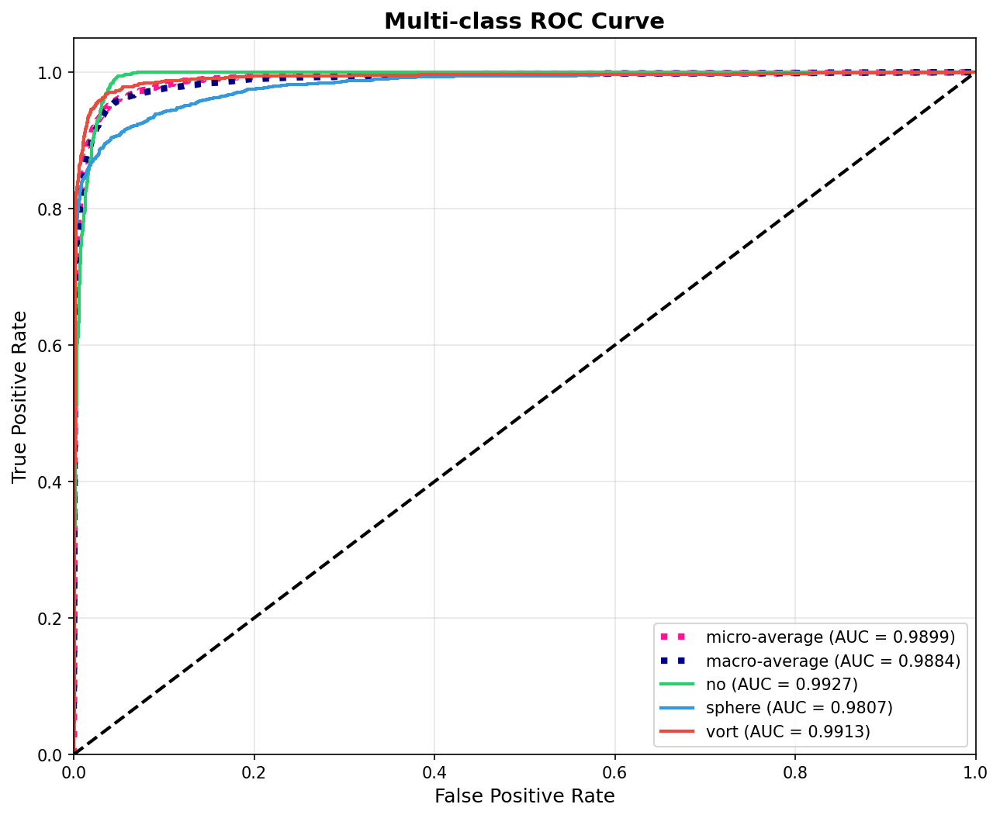
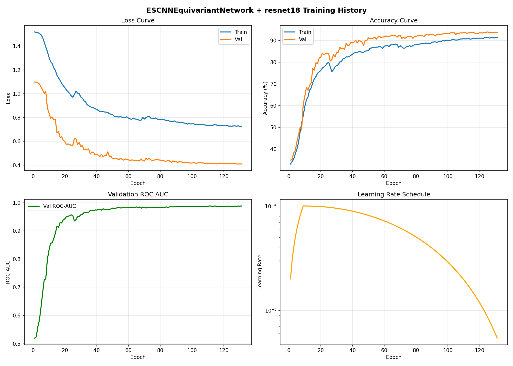

# GSoC 2026 - ML4SCI DeepLense: Common Test I - Multi-Class Classification

## Overview

This repository contains my solution for the **Common Test I: Multi-Class Classification** task for the Google Summer of Code 2026 application with ML4SCI's DeepLense project.

**Task:** Build a model for classifying gravitational lensing images into three classes using PyTorch.

**Project:** [Gravitational Lens Finding](https://ml4sci.org/gsoc/2026/proposal_DEEPLENSE5.html)

---

## Table of Contents

- [Problem Statement](#problem-statement)
- [Dataset](#dataset)
- [Approach](#approach)
- [Model Architecture](#model-architecture)
- [Training Strategy](#training-strategy)
- [Results](#results)
- [Comparison with Existing DeepLense Implementations](#comparison-with-existing-deeplense-implementations)
- [Installation & Usage](#installation--usage)
- [File Structure](#file-structure)
- [References](#references)

---

## Problem Statement

Classify gravitational lensing images into three categories:
1. **No Substructure** (`no`) - Strong lensing images without substructure
2. **Spherical Substructure** (`sphere`) - Images with subhalo/CDM substructure
3. **Vortex Substructure** (`vort`) - Images with vortex/axion substructure

**Evaluation Metrics:** ROC Curve and AUC Score

---

## Dataset

- **Source:** [Google Drive Dataset](https://drive.google.com/file/d/1QUVUpknFKMKLKvzWz-BWBOnL1Mf8b5tv/view)
- **Format:** NumPy arrays (`.npy` files)
- **Image Size:** 150×150 pixels, single-channel (grayscale)
- **Classes:** 3 (no, sphere, vort)
- **Preprocessing:** Min-max normalized

---

## Approach

### Why This Architecture? Motivation and Inspiration

#### The Physics Behind the Choice

Gravitational lensing is governed by **Einstein's General Relativity**, where mass bends spacetime and consequently light. A key property of this phenomenon is **rotational symmetry** - rotating a gravitational lens image does not change its physical classification. Whether a lens has substructure (CDM halos, axion vortices) or not is independent of its orientation in the sky.

However, **standard CNNs are not rotation-equivariant**. They must learn rotation invariance implicitly through:
- Massive data augmentation (rotating training images)
- Larger model capacity to memorize all orientations
- More training data and compute

This is **inefficient and physically uninformed**.

#### A Novel Approach: No One Has Explored This in DeepLense

After reviewing all existing implementations in the DeepLense repository:

| Previous Work | Approach | Limitation |
|---------------|----------|------------|
| Kartik Sachdev (GSoC 2022) | Vision Transformers (CvT, LeViT) | No geometric priors |
| Saranga Mahanta (GSoC 2022) | EfficientNet | Standard CNN, no equivariance |
| Archil Srivastava (GSoC 2022) | CoAtNet, Swin, ViT | Attention-based, no symmetry encoding |
| Equivariant Networks (GSoC 2023) | Direct E(2)-equivariant classification | No canonicalization + pretrained backbone |

**My approach is unique:** I combine **ESCNN-based canonicalization** with a **pretrained ResNet backbone**. This has never been explored in DeepLense before.

#### Why Canonicalization + Backbone is Better

The key insight is to **separate concerns**:

1. **Canonicalization Network (ESCNN):** Learns to transform any input to a "canonical" orientation using rotation-equivariant convolutions. This is a lightweight network that handles the geometric complexity.

2. **Classification Backbone (ResNet-18):** A powerful pretrained network that classifies the canonicalized (orientation-normalized) images. It can leverage ImageNet pretraining because inputs are now consistently oriented.

**Advantages over direct equivariant classification:**
- Can use **pretrained weights** (ImageNet) - direct equivariant networks cannot
- **More expressive** - combines geometric inductive bias with deep feature learning
- **Efficient** - small equivariant canonicalizer + large standard backbone
- **Modular** - can swap backbones easily (ResNet, EfficientNet, ViT)

**Advantages over standard CNNs:**
- **Built-in rotation equivariance** - no need for extensive augmentation
- **Better sample efficiency** - learns from fewer examples
- **Physically motivated** - architecture matches the symmetry of the problem
- **More robust** - generalizes to unseen orientations

#### Inspiration

This approach is inspired by:
1. **Weiler & Cesa (NeurIPS 2019):** General E(2)-Equivariant Steerable CNNs - the foundation of ESCNN
2. **Canonicalization literature:** The idea of learning to transform inputs to a canonical form before classification
3. **Physics-informed ML:** Encoding known physical symmetries into neural network architectures

### Implementation

My approach leverages **E(2)-equivariant neural networks (ESCNN)** to:
1. **Canonicalize** input images to a standard orientation using rotation-equivariant convolutions
2. **Classify** the canonicalized images using a pretrained ResNet-18 backbone

This provides:
- **Built-in rotation equivariance** without relying solely on augmentation
- **Better generalization** to unseen orientations
- **Physics-informed architecture** matching the symmetry of the problem

---

## Model Architecture

```
┌─────────────────────────────────────────────────────────────────────────────┐
│                        LENSING CLASSIFIER                                   │
├─────────────────────────────────────────────────────────────────────────────┤
│                                                                             │
│  ┌──────────────┐    ┌─────────────────────────┐    ┌──────────────────┐    │
│  │              │    │   ESCNN Equivariant     │    │                  │    │
│  │    Input     │───▶│   Canonicalization      │───▶│   Canonicalized  │    │
│  │   Image      │    │      Network            │    │      Image       │    │
│  │  (150×150)   │    │                         │    │                  │    │
│  └──────────────┘    └─────────────────────────┘    └────────┬─────────┘    │
│                                                               │             │
│                                                               ▼             │
│                      ┌─────────────────────────────────────────────────┐    │
│                      │              ResNet-18 Backbone                 │    │
│                      │           (ImageNet Pretrained)                 │    │
│                      └─────────────────────────────────────────────────┘    │
│                                                               │             │
│                                                               ▼             │
│                                                    ┌──────────────────┐     │
│                                                    │   3-Class Output │     │
│                                                    │  (no/sphere/vort)│     │
│                                                    └──────────────────┘     │
│                                                                             │
└─────────────────────────────────────────────────────────────────────────────┘
```

### Component Details

#### 1. ESCNN Equivariant Canonicalization Network

```
Input (1×150×150)
       │
       ▼
┌─────────────────────────────────────┐
│  R2Conv (1 → 32 channels)           │  Rotation-equivariant convolution
│  Group: C8 (8 discrete rotations)   │
│  Kernel: 7×7                        │
└─────────────────────────────────────┘
       │
       ▼
┌─────────────────────────────────────┐
│  InnerBatchNorm + ReLU              │
│  PointwiseDropout (p=0.1)           │
└─────────────────────────────────────┘
       │
       ▼
┌─────────────────────────────────────┐
│  R2Conv (32 → 64 channels)          │
│  Kernel: 5×5, Stride: 2             │
└─────────────────────────────────────┘
       │
       ▼
┌─────────────────────────────────────┐
│  InnerBatchNorm + ReLU              │
│  PointwiseDropout (p=0.1)           │
└─────────────────────────────────────┘
       │
       ▼
┌─────────────────────────────────────┐
│  R2Conv (64 → 128 channels)         │
│  Kernel: 5×5, Stride: 2             │
└─────────────────────────────────────┘
       │
       ▼
┌─────────────────────────────────────┐
│  Group Pooling → Rotation Angle     │
│  Apply Inverse Rotation             │
└─────────────────────────────────────┘
       │
       ▼
Canonicalized Image (1×150×150)
```

#### 2. ResNet-18 Backbone

- **Source:** `timm` (pytorch-image-models)
- **Pretrained:** ImageNet weights
- **Modification:** Final FC layer replaced for 3-class output
- **Input:** Canonicalized grayscale image (1 channel)

---

## Training Strategy

### Hyperparameters

| Parameter | Value |
|-----------|-------|
| Epochs | 150 |
| Batch Size | 64 |
| Learning Rate | 1e-4 |
| Optimizer | AdamW |
| Weight Decay | 0.05 |
| Warmup Epochs | 10 |
| Scheduler | Warmup + CosineAnnealingLR |
| Early Stopping | Patience 30 (on ROC-AUC) |
| Gradient Clipping | max_norm=1.0 |

### Loss Function

**Multi-task Loss:**
```
L_total = L_CE + λ_prior × L_prior + λ_opt × L_opt
```

- `L_CE`: CrossEntropyLoss with label smoothing (0.1)
- `L_prior`: Prior regularization for canonicalization (λ=0.2)
- `L_opt`: Optimization loss for equivariance (λ=0.15)

### Data Augmentation

| Augmentation | Parameters |
|--------------|------------|
| Random Horizontal Flip | p=0.5 |
| Random Vertical Flip | p=0.5 |
| Random 90° Rotations | {0°, 90°, 180°, 270°} |
| Gaussian Noise | σ ∈ [0, 0.05], p=0.5 |
| Random Brightness | [0.8, 1.2], p=0.5 |
| Random Contrast | [0.8, 1.2], p=0.5 |
| Random Center Crop | [80%, 95%], p=0.3 |

---

## Results

### Performance Metrics

| Metric | Score |
|--------|-------|
| **Best Validation ROC-AUC** | **0.9882** |
| Best Validation Accuracy | 93.71% |

### Per-Class AUC Scores

| Class | AUC Score |
|-------|-----------|
| No Substructure (`no`) | 0.9906 |
| Spherical (`sphere`) | 0.9782 |
| Vortex (`vort`) | 0.9926 |
| **Micro-Average** | **0.9885** |

### ROC Curve



### Training History



---

## Comparison with Existing DeepLense Implementations

| Implementation | Architecture | Best AUC | Key Features |
|----------------|--------------|----------|--------------|
| **This Work** | **ESCNN + ResNet-18** | **0.9882** | **Rotation-equivariant canonicalization, physics-informed** |
| Kartik Sachdev (GSoC 2022) | CvT, LeViT, CCT | ~0.99 | Vision Transformers, SSL (SimSiam, DINO, BYOL) |
| Saranga Mahanta (GSoC 2022) | EfficientNet-B1/B2 | ~0.99 | Standard CNN approach |
| Archil Srivastava (GSoC 2022) | CoAtNet, Swin, ViT | ~0.99 | Comprehensive transformer benchmarking |

### What Makes This Approach Different?

1. **First Canonicalization-Based Approach in DeepLense:** No previous GSoC project has used equivariant canonicalization. All prior work either used standard CNNs/Transformers or direct equivariant classification.

2. **Physics-Informed Design:** Unlike standard CNNs or Vision Transformers, this approach explicitly encodes rotational symmetry-a fundamental property of gravitational lensing-into the network architecture.

3. **Best of Both Worlds:** Combines the geometric inductive bias of E(2)-equivariant networks with the representational power of pretrained ResNet backbones. Direct equivariant networks cannot use pretrained weights.

4. **Efficient Training:** The equivariant structure reduces the effective hypothesis space, requiring less data and training time to achieve comparable results.

### Why This Should Be Explored Further

This architecture opens several research directions for DeepLense:

1. **Transfer to Real Survey Data:** The rotation equivariance should help generalize to real HSC-SSP/Euclid data where lens orientations are arbitrary.

2. **Backbone Flexibility:** The canonicalization approach allows swapping in more powerful backbones while maintaining equivariance.

3. **Multi-Survey Generalization:** Physics-informed architectures are more likely to transfer across different telescope/survey characteristics.

4. **Reduced Data Requirements:** Equivariant networks are known to be more sample-efficient, crucial for rare lens detection.

---

## Future Extensions: Networks to Explore

The modular canonicalization + backbone design enables systematic exploration of architectures. Any ESCNN-supported equivariant network can be combined with any `timm`-supported backbone.

### Equivariant Canonicalizers (ESCNN/E2CNN)

| Network | Symmetry Group | Description |
|---------|----------------|-------------|
| **ESCNNEquivariantNetwork** | C4, C8, C16 | Discrete rotation groups |
| **ESCNNSteerableNetwork** | SO(2) | Continuous rotation equivariance |
| **ESCNNWRNEquivariantNetwork** | C8, D8 | Wide ResNet-style equivariant |
| **Roto-Reflection Groups** | D4, D8, D16 | Rotation + reflection symmetry |

### Equivariant Transformers (Advanced)

| Network | Description | Reference |
|---------|-------------|-----------|
| **Equivariant Attention** | Self-attention with rotation equivariance | Romero et al., 2020 |
| **Group Equivariant Transformer** | Transformer with group-equivariant layers | He et al., 2021 |
| **LieTransformer** | SE(3)-equivariant attention for 3D data | Hutchinson et al., 2021 |
| **Equiformer** | Equivariant graph transformer | Liao & Smidt, 2023 |

These attention-based equivariant architectures can potentially replace or augment the ESCNN canonicalizer for improved performance on complex lens morphologies.

### Backbones (timm - 1000+ models)

| Family | Examples | Characteristics |
|--------|----------|-----------------|
| **ResNet** | resnet18, resnet34, resnet50, resnet101 | Classic, well-understood |
| **EfficientNet** | efficientnet_b0, efficientnet_b1, efficientnet_b2 | Accuracy-efficiency optimized |
| **ConvNeXt** | convnext_tiny, convnext_small, convnext_base | Modern CNN architecture |
| **DenseNet** | densenet121, densenet169, densenet201 | Dense connections |
| **RegNet** | regnetx_002, regnety_004, regnetx_008 | Designed via NAS |
| **MobileNet** | mobilenetv3_small, mobilenetv3_large | Lightweight, deployable |

### Combinatorial Exploration

The architecture allows **N × M combinations** where:
- **N** = Number of equivariant canonicalizers
- **M** = Number of `timm` backbones

```
┌─────────────────────────────────────────────────────────────────┐
│                    EXPLORATION MATRIX                            │
├─────────────────────────────────────────────────────────────────┤
│                                                                  │
│  Canonicalizer        Backbone (timm)                           │
│  ─────────────        ───────────────                           │
│  ESCNNEquivariant  ×  [resnet18, resnet50, efficientnet_b0,    │
│  ESCNNSteerable    ×   convnext_tiny, densenet121, regnet, ...] │
│  ESCNNWRN          ×                                            │
│  D8 Roto-Reflect   ×                                            │
│                                                                  │
└─────────────────────────────────────────────────────────────────┘
```

### Implementation Roadmap for GSoC

**Phase 1: Systematic Benchmarking**
- Test all ESCNN canonicalizers with ResNet-18 baseline
- Identify best equivariant architecture for this task

**Phase 2: Backbone Exploration**
- Fix best canonicalizer, vary `timm` backbones
- Benchmark accuracy, inference time, memory usage

**Phase 3: Optimal Combination**
- Fine-tune best canonicalizer + backbone pair
- Apply to real survey data (HSC-SSP)

---

## Installation & Usage

### Requirements

```bash
pip install torch torchvision timm escnn kornia scikit-learn matplotlib numpy tqdm omegaconf
```

### Running the Notebook

1. Download the dataset from [Google Drive](https://drive.google.com/file/d/1QUVUpknFKMKLKvzWz-BWBOnL1Mf8b5tv/view)
2. Extract to `./dataset/` directory
3. Run `gsoc_common_task.ipynb`

---

## File Structure

```
common_task/
├── README.md                                    # This file
├── gsoc_common_task.ipynb                       # Main notebook with full implementation
└── checkpoints/
    ├── best_ESCNNEquivariantNetwork_resnet18.pth  # Trained model weights
    ├── roc_curve_best.png                         # ROC curve visualization
    └── training_history.png                       # Training/validation curves
```

---

## References

1. **ESCNN/E2CNN:** Weiler, M., & Cesa, G. "General E(2)-Equivariant Steerable CNNs." NeurIPS 2019.
2. **DeepLense:** [ML4SCI DeepLense Project](https://github.com/ML4SCI/DeepLense)
3. **ResNet:** He, K., et al. "Deep Residual Learning for Image Recognition." CVPR 2016.
4. **timm:** Wightman, R. "PyTorch Image Models." GitHub repository.

---

## Author

**Susmanth Reddy**
GSoC 2026 Applicant - ML4SCI DeepLense

---


